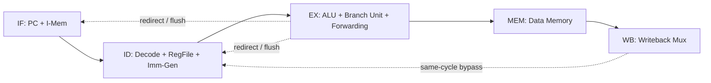
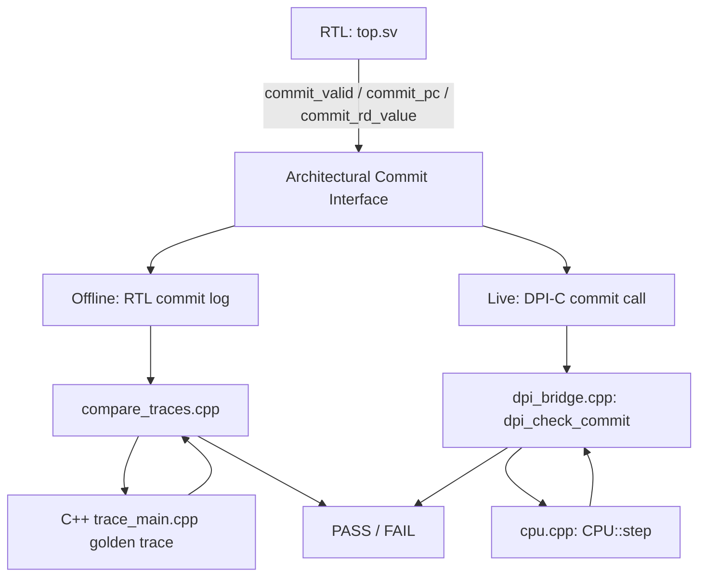

<div align="center">

# RV32I Five-Stage Pipelined Processor
### with a Cycle-Accurate C++ Golden Model and SystemVerilog DPI-C Lockstep Verification

**RTL Design · Design Verification · Differential Testing · DPI-C Co-Simulation**

</div>

<div align="center">

``

*Suggested banner: pipeline block diagram spanning IF → ID → EX → MEM → WB, with the C++ golden model and DPI-C bridge shown below the RTL as a verification layer.*

</div>

---

## Overview

This repository implements a synthesizable **RV32I, five-stage, in-order pipelined processor** in SystemVerilog, together with a fully independent **cycle-accurate C++ reference model** of the same architecture. The two implementations are verified against each other using three complementary methodologies:

1. **RTL directed regression** — SystemVerilog testbench with concurrent pipeline assertions
2. **Offline differential verification** — RTL commit trace vs. C++ commit trace, compared post-simulation
3. **Live DPI-C lockstep verification** — the C++ model executes *inside* the Verilator simulation via SystemVerilog DPI-C, checking every RTL commit cycle-by-cycle against the golden model in real time

This project was built to demonstrate the complete verification methodology used in industry CPU design — not just "does the RTL run a program," but "does the RTL match a golden architectural reference on every single retired instruction."

``

---

## Features

- RV32I five-stage pipeline: IF, ID, EX, MEM, WB — implemented from scratch in SystemVerilog
- Full operand forwarding (EX/MEM → EX, MEM/WB → EX) with EX/MEM-priority resolution
- Load-use hazard detection with single-cycle stall and bubble insertion
- Same-cycle WB → ID register bypass
- Branch/jump resolution in EX with two-cycle flush on redirect (`BEQ`, `BNE`, `BLT`, `BGE`, `BLTU`, `BGEU`, `JAL`, `JALR`)
- Dedicated architectural **commit interface** exposed at the top level (`commit_valid`, `commit_pc`, `commit_instr`, `commit_reg_write`, `commit_rd`, `commit_rd_value`)
- Independent C++17 golden reference model (fetch/decode/execute, byte-addressable memory, architectural commit records)
- 14 concurrent SystemVerilog assertions covering x0 integrity, PC alignment, stall/bubble legality, flush legality, and forwarding-mux legality/priority
- Offline trace-based differential verification (`compare_traces`)
- Live cycle-accurate DPI-C lockstep verification against the same C++ model, compiled directly into the Verilator simulation binary
- Ten directed regression programs exercising ALU, forwarding, load/store, load-use hazards, all six branch conditions, JAL, and JALR

---

## Repository Structure

```
Riscvprocessor/
├── rtl/
│   ├── core/          top.sv, pc.sv, branch_unit.sv
│   ├── decoder/        control_unit.sv, alu_control.sv, imm_gen.sv
│   ├── alu/            alu.sv
│   ├── regfile/        regfile.sv
│   ├── pipeline/       if_id.sv, id_ex.sv, ex_mem.sv, mem_wb.sv
│   ├── hazard/         hazard_unit.sv, forwarding_unit.sv
│   └── memory/         instruction_memory.sv, data_memory.sv
├── tb/
│   ├── basic/          top_tb.sv              — directed RTL testbench
│   ├── assertions/      pipeline_assertions.sv  — 14 concurrent checks
│   └── dpi/             dpi_tb.sv               — Verilator + DPI-C lockstep TB
├── cpp_model/
│   ├── include/         cpu.h, decoder.h, memory.h, instruction.h, commit.h, trace_parser.h
│   ├── src/             cpu.cpp, decoder.cpp, memory.cpp, trace_main.cpp, ...
│   ├── dpi/             dpi_bridge.cpp          — DPI-C entry points
│   ├── tools/           compare_traces.cpp      — offline trace differ
│   └── tests/           test_runner.cpp          — 10 self-checking C++ unit tests
├── tests/directed/      10 .hex directed test programs
├── scripts/             build + regression automation (see Quick Start)
├── sim/logs/            RTL and DPI regression logs
├── traces/differential/ RTL / C++ / diff logs per test
└── docs/                this documentation set
```

See [`02_Repository_Architecture.md`](02_Repository_Architecture.md) for a full module-by-module breakdown.

---

## Architecture Summary

Single-issue, in-order, five-stage RV32I pipeline. No branch prediction — all control transfers are resolved in EX and cost a two-cycle flush on redirect. One hazard class exists by construction (load-use), handled by a dedicated hazard unit that stalls IF/ID and inserts a bubble into ID/EX.



Full pipeline, hazard, forwarding, and control-flow diagrams are provided in [`04_Five_Stage_Pipeline.md`](04_Five_Stage_Pipeline.md) through [`10_Control_Hazards.md`](10_Control_Hazards.md).

---

## Verification Methodology



Four verification layers, run end-to-end by `scripts/run_all.sh`:

| Layer | Mechanism | Script |
|---|---|---|
| RTL directed regression | Icarus Verilog + `top_tb.sv` + 14 concurrent assertions | `scripts/run_regression.sh` |
| C++ golden-model regression | Self-checking C++ unit tests | `scripts/run_cpp_regression.sh` |
| Offline differential verification | RTL commit log vs. C++ commit trace, compared post-run | `scripts/run_differential.sh` |
| DPI-C live lockstep | C++ model executes inside the Verilator sim; every commit checked in real time | `scripts/build_dpi.sh` + `scripts/run_dpi_regression.sh` |

Full explanation of *why* each layer exists is in [`13_Differential_Verification.md`](13_Differential_Verification.md) and [`14_DPI_Lockstep_Verification.md`](14_DPI_Lockstep_Verification.md).

---

## Regression Summary

Results below are taken directly from the logs checked into this repository (`sim/logs/`, `traces/differential/`, `sim/logs/dpi/`), each independently confirmed present and consistent across all ten directed tests.

| Verification Layer | Result |
|---|---|
| RTL Directed Regression | **10 / 10 PASS** |
| Pipeline Assertions (embedded) | **0 failures** |
| Offline Differential Verification | **10 / 10 PASS** |
| DPI-C Lockstep Verification | **10 / 10 PASS** |

A note on the C++ standalone regression log: the log file checked into the repository root (`cpp_regression_new.log`) reflects an older build and shows a failing run. Rebuilding `cpp_model/tests/test_runner.cpp` against the current sources produces a clean 10/10 pass, consistent with the other three layers. Details and root cause are documented in [`19_Limitations.md`](19_Limitations.md).

---

## Supported Instructions

| Class | Instructions | Count |
|---|---|---|
| R-Type | `ADD SUB SLL SLT SLTU XOR SRL SRA OR AND` | 10 |
| I-Type ALU | `ADDI SLTI SLTIU XORI ORI ANDI SLLI SRLI SRAI` | 9 |
| Load / Store | `LW SW` (word-aligned only) | 2 |
| Branch | `BEQ BNE BLT BGE BLTU BGEU` | 6 |
| Jump | `JAL JALR` | 2 |
| Upper Immediate | `LUI AUIPC` | 2 |
| **Total** | | **31** |

Byte/half-word loads and stores, CSR access, `FENCE`, `ECALL`/`EBREAK`, and the M-extension are not implemented in either the RTL or the C++ model. See [`19_Limitations.md`](19_Limitations.md).

---

## Quick Start

### Prerequisites

- [Icarus Verilog](http://iverilog.icarus.com/) (`iverilog`, `vvp`) — RTL directed regression
- [Verilator](https://www.veripool.org/verilator/) 5.x — DPI-C lockstep regression
- A C++17 compiler (`clang++` or `g++`)
- `bash`

### Build and Run — RTL Directed Regression

```bash
./scripts/run_regression.sh
```

Compiles all RTL and testbench sources with Icarus Verilog into `sim/cpu_sim`, then runs all 10 directed tests, e.g.:

```bash
vvp sim/cpu_sim +TEST_ID=10 +PROGRAM=tests/directed/full_regression.hex
```

### Build and Run — C++ Golden Model Regression

```bash
./scripts/run_cpp_regression.sh
```

### Build and Run — Offline Differential Verification

```bash
./scripts/run_differential.sh
```

Compares the RTL commit log against the C++ golden trace for each of the 10 directed programs using `compare_traces`.

### Build and Run — DPI-C Live Lockstep Verification

```bash
./scripts/build_dpi.sh
./scripts/run_dpi_regression.sh
```

Builds a Verilator simulation binary (`sim/dpi_build/obj_dir/Vdpi_tb`) with the C++ golden model compiled directly into it via DPI-C, then runs all 10 directed programs checking every commit in real time, e.g.:

```bash
sim/dpi_build/obj_dir/Vdpi_tb +PROGRAM=tests/directed/alu.hex
```

### Run Everything

```bash
./scripts/run_all.sh
```

Runs all four verification stages in sequence and prints a final project-level pass/fail summary.

---

## Results

```
==================================================
           PROJECT REGRESSION SUMMARY
==================================================
Verification stages : 4
Passed               : 4
Failed               : 0
==================================================
       ALL VERIFICATION STAGES PASSED
==================================================
```

Per-stage detail is in [`18_Verification_Results.md`](18_Verification_Results.md).

---

## Screenshots

``
*Suggested: GTKWave view of `waves/top.vcd` showing a branch redirect and the resulting IF/ID and ID/EX flush.*

``
*Suggested: terminal capture of `scripts/run_all.sh` showing the four-stage PASS summary.*

---

## Documentation Index

| Document | Contents |
|---|---|
| [01_Project_Overview.md](01_Project_Overview.md) | Project goals, scope, methodology overview |
| [02_Repository_Architecture.md](02_Repository_Architecture.md) | Full directory and module map |
| [03_RISCV_Architecture.md](03_RISCV_Architecture.md) | RV32I ISA subset implemented |
| [04_Five_Stage_Pipeline.md](04_Five_Stage_Pipeline.md) | Pipeline stage-by-stage walkthrough |
| [05_Control_Unit.md](05_Control_Unit.md) | Instruction decode and control signal generation |
| [06_ALU_and_Datapath.md](06_ALU_and_Datapath.md) | ALU, ALU control, operand muxing |
| [07_Pipeline_Registers.md](07_Pipeline_Registers.md) | IF/ID, ID/EX, EX/MEM, MEM/WB contents |
| [08_Hazard_Detection.md](08_Hazard_Detection.md) | Load-use hazard detection and stalling |
| [09_Forwarding.md](09_Forwarding.md) | Forwarding unit and priority logic |
| [10_Control_Hazards.md](10_Control_Hazards.md) | Branch/jump resolution and flush logic |
| [11_Memory_System.md](11_Memory_System.md) | Instruction and data memory |
| [12_CPP_Golden_Model.md](12_CPP_Golden_Model.md) | C++ reference model architecture |
| [13_Differential_Verification.md](13_Differential_Verification.md) | Offline trace comparison methodology |
| [14_DPI_Lockstep_Verification.md](14_DPI_Lockstep_Verification.md) | DPI-C bridge and live lockstep checking |
| [15_Testing.md](15_Testing.md) | Directed test suite and assertions |
| [16_Build_Guide.md](16_Build_Guide.md) | Full build instructions for every layer |
| [17_Debugging_Guide.md](17_Debugging_Guide.md) | Waveform debugging, log interpretation |
| [18_Verification_Results.md](18_Verification_Results.md) | Full regression result tables |
| [19_Limitations.md](19_Limitations.md) | Known gaps, stale artifacts, unimplemented features |
| [20_Future_Work.md](20_Future_Work.md) | Suggested extensions |

---

## License

No `LICENSE` file is currently included in this repository. Until one is added, all rights are reserved by the author by default. A permissive license (e.g. MIT) is recommended if open redistribution is intended.

---

## Author

**Aditya Patel**
Repository: [Cycle-Accurate-C-Simulator-SystemVerilog-RISC-V-Core-via-DPI-C](https://github.com/Adityapatel9919/Cycle-Accurate-C-Simulator-SystemVerilog-RISC-V-Core-via-DPI-C)