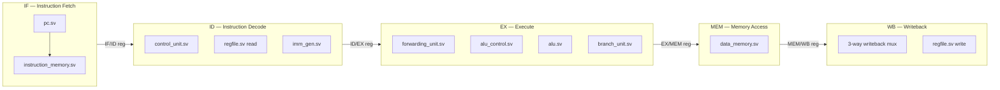

# 04. Five-Stage Pipeline

## 4.1 Pipeline Overview

The processor is a classic 5-stage in-order pipeline, entirely contained in `rtl/core/top.sv` and its submodules:



Each arrow labeled with a pipeline register (`IF/ID`, `ID/EX`, `EX/MEM`, `MEM/WB`) corresponds to one of the four registered modules in `rtl/pipeline/`, detailed fully in [07_Pipeline_Registers.md](07_Pipeline_Registers.md).

## 4.2 Stage-by-Stage Description

### IF — Instruction Fetch

Instantiated modules: `pc`, `instruction_memory`.

```systemverilog
assign pc_plus4_if = pc_current + 32'd4;
```

Every cycle, the current PC addresses `instruction_memory` (a 1024-word array) and produces `instruction_if`. `pc_plus4_if` is computed unconditionally alongside it; whether the pipeline actually advances to `pc_plus4_if` or is redirected to a branch/jump target is decided in EX and fed back combinationally (see §4.4 and [10_Control_Hazards.md](10_Control_Hazards.md)).

### ID — Instruction Decode

Instantiated modules: `control_unit`, `imm_gen`, `regfile` (read ports).

```systemverilog
assign opcode_id  = if_id_instruction[6:0];
assign rd_id      = if_id_instruction[11:7];
assign funct3_id  = if_id_instruction[14:12];
assign rs1_id     = if_id_instruction[19:15];
assign rs2_id     = if_id_instruction[24:20];
assign funct7_id  = if_id_instruction[31:25];
```

The instruction latched in `if_id_instruction` is split into its fixed-position fields combinationally. `control_unit` maps `opcode_id` to every downstream control signal; `imm_gen` extracts the format-appropriate immediate; `regfile` supplies `rs1_data_raw`/`rs2_data_raw` for the two source registers.

A same-cycle **WB→ID bypass** is applied here, before the values are latched into ID/EX:

```systemverilog
if (
    mem_wb_reg_write &&
    (mem_wb_rd != 5'd0) &&
    (mem_wb_rd == rs1_id)
) begin
    rs1_data_id = writeback_data;
end
```

This exists because the register file's read and write both happen in the same stage boundary — without this bypass, an instruction being written back in the same cycle that a later instruction reads that same register in ID would read the stale (pre-write) value out of the register array.

### EX — Execute

Instantiated modules: `forwarding_unit`, `alu_control`, `alu`, `branch_unit`.

The EX stage does three things in parallel: selects forwarded operand values, computes the ALU result, and evaluates the branch condition (if the instruction is a branch). Full detail on forwarding is in [09_Forwarding.md](09_Forwarding.md); full detail on ALU operand selection is in [06_ALU_and_Datapath.md](06_ALU_and_Datapath.md).

### MEM — Memory Access

Instantiated module: `data_memory`.

```systemverilog
data_memory #(.MEM_DEPTH(1024)) dmem_inst (
    .clk        (clk),
    .mem_read   (ex_mem_mem_read),
    .mem_write  (ex_mem_mem_write),
    .addr       (ex_mem_alu_result),
    .write_data (ex_mem_rs2_data),
    .read_data  (memory_read_data)
);
```

The address for a memory access is always the EX-stage ALU result (rs1 + immediate) — this is standard: loads and stores compute their effective address through the ALU in EX, then use it to index memory in MEM. The store data (`ex_mem_rs2_data`) is the forwarded rs2 value carried forward from EX, so a store that depends on a value produced by a preceding instruction still benefits from EX-stage forwarding.

### WB — Writeback

```systemverilog
always_comb begin
    case (mem_wb_wb_sel)
        WB_ALU: writeback_data = mem_wb_alu_result;
        WB_MEM: writeback_data = mem_wb_memory_data;
        WB_PC4: writeback_data = mem_wb_pc_plus4;
        default: writeback_data = 32'b0;
    endcase
end
```

A 3-way mux selects the value that is written back to the register file: the ALU result (most instructions), the memory read data (`LW`), or `PC+4` (the link value for `JAL`/`JALR`). This selected value is also what is forwarded to EX (`forward_a`/`forward_b == 2'b01`) and what is used in the WB→ID bypass — `writeback_data` is the single canonical "value this instruction produced" signal for the whole pipeline.

## 4.3 Pipeline Register Summary

| Register | Module | Carries |
|---|---|---|
| IF/ID | `if_id.sv` | PC, raw instruction, `valid` |
| ID/EX | `id_ex.sv` | PC, PC+4, instruction, rs1/rs2 data, immediate, rs1/rs2/rd addresses, funct3/funct7, all EX/MEM/WB control signals |
| EX/MEM | `ex_mem.sv` | PC, PC+4, instruction, ALU result, forwarded rs2 data (store data), rd, MEM/WB control signals |
| MEM/WB | `mem_wb.sv` | PC, PC+4, instruction, ALU result, memory read data, rd, WB control signals |

Full field-by-field listings are in [07_Pipeline_Registers.md](07_Pipeline_Registers.md).

## 4.4 Control Flow and Timing

There is no branch prediction. Every branch and jump is resolved in EX:

```systemverilog
assign control_transfer_ex =
    (id_ex_branch && branch_taken_ex)
    || id_ex_jump;

always_comb begin
    pc_next = pc_plus4_if;
    if (control_transfer_ex)
        pc_next = redirect_target_ex;
end
```

Because resolution happens in EX (two stages after fetch), by the time a taken branch or jump is discovered, the pipeline has already fetched the two sequential instructions immediately following it (in IF and ID). Both are architecturally wrong and must be discarded:

```systemverilog
assign if_id_flush = control_transfer_ex;
assign id_ex_flush = id_ex_flush_hazard | control_transfer_ex;
```

This is the two-cycle branch/jump penalty, detailed fully with a cycle-by-cycle diagram in [10_Control_Hazards.md](10_Control_Hazards.md).

## 4.5 Pipeline Timing Diagram (Steady State, No Hazards)

```mermaid
gantt
    title Steady-State Pipeline (4 back-to-back instructions, no hazards)
    dateFormat X
    axisFormat %s
    section Instr 1
    IF : 0, 1
    ID : 1, 2
    EX : 2, 3
    MEM : 3, 4
    WB : 4, 5
    section Instr 2
    IF : 1, 2
    ID : 2, 3
    EX : 3, 4
    MEM : 4, 5
    WB : 5, 6
    section Instr 3
    IF : 2, 3
    ID : 3, 4
    EX : 4, 5
    MEM : 5, 6
    WB : 6, 7
    section Instr 4
    IF : 3, 4
    ID : 4, 5
    EX : 5, 6
    MEM : 6, 7
    WB : 7, 8
```



In the absence of hazards, one instruction commits (reaches MEM/WB) every cycle, giving an ideal throughput of one instruction per cycle. Stalls (load-use hazard, [08_Hazard_Detection.md](08_Hazard_Detection.md)) and flushes (control hazard, [10_Control_Hazards.md](10_Control_Hazards.md)) are the only two ways this ideal rate is broken in this design.

## 4.6 Commit Point

An instruction becomes architecturally visible — i.e., committed — when it is valid in the MEM/WB pipeline register:

```systemverilog
always_comb begin
    commit_valid     = mem_wb_valid;
    commit_pc        = mem_wb_pc;
    commit_instr     = mem_wb_instr;
    commit_reg_write = mem_wb_valid && mem_wb_reg_write && (mem_wb_rd != 5'd0);
    commit_rd        = mem_wb_rd;
    commit_rd_value  = writeback_data;
end
```

This is the single point where verification "looks in" on the design. It is also textually mirrored by an `always_ff` block that prints a human/machine-readable `COMMIT PC=... INSTR=... RD=... VALUE=...` line every cycle a valid instruction reaches this stage — this printed line is what both the offline differential checker and the C++ trace parser consume (see [13_Differential_Verification.md](13_Differential_Verification.md)).
