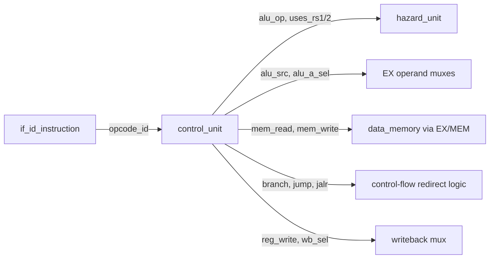

# 05. Control Unit

## 5.1 Purpose

`control_unit.sv` is the sole source of instruction control signals in this design. It is a purely combinational module: given a 7-bit `opcode`, it produces every control signal needed by the rest of the pipeline for that instruction class. It does not look at `funct3` or `funct7` — those are only needed later, in `alu_control.sv` and `branch_unit.sv`, to refine *which* ALU/branch operation to perform within an opcode class.

## 5.2 Interface

```systemverilog
module control_unit (
    input  logic [6:0] opcode,

    output logic       uses_rs1,
    output logic       uses_rs2,

    output logic       alu_src,
    output logic [1:0] alu_op,
    output logic [1:0] alu_a_sel,

    output logic       mem_read,
    output logic       mem_write,
    output logic       branch,

    output logic       jump,
    output logic       jalr,

    output logic       reg_write,
    output logic [1:0] wb_sel
);
```

| Signal | Direction | Meaning |
|---|---|---|
| `opcode` | in | Bits `[6:0]` of the ID-stage instruction |
| `uses_rs1`, `uses_rs2` | out | Whether this instruction reads rs1/rs2 — consumed only by `hazard_unit` for load-use detection, not by the datapath itself |
| `alu_src` | out | ALU operand B select: 0 = rs2, 1 = immediate |
| `alu_op` | out | 2-bit hint to `alu_control`, distinguishing "address calc" / "branch compare" / "R-type" / "I-type" |
| `alu_a_sel` | out | ALU operand A select: rs1 / PC / zero |
| `mem_read`, `mem_write` | out | Data memory access enables |
| `branch` | out | Instruction is a conditional branch |
| `jump`, `jalr` | out | Instruction is an unconditional jump; `jalr` distinguishes `JALR` from `JAL` for target computation |
| `reg_write` | out | Instruction writes a destination register |
| `wb_sel` | out | Writeback source select: ALU result / memory data / PC+4 |

## 5.3 Default Assignment Block

```systemverilog
always_comb begin
    uses_rs1 = 1'b0;
    uses_rs2 = 1'b0;
    alu_src   = 1'b0;
    alu_op    = 2'b00;
    alu_a_sel = ALU_A_RS1;
    mem_read  = 1'b0;
    mem_write = 1'b0;
    branch    = 1'b0;
    jump      = 1'b0;
    jalr      = 1'b0;
    reg_write = 1'b0;
    wb_sel    = WB_ALU;

    case (opcode)
        ...
        default: begin
            // Defaults already create a no-side-effect operation.
        end
    endcase
end
```

Every signal is given a safe default before the `case` statement runs. This means an unrecognized opcode falls through to `default:` and produces an instruction that reads no registers, writes no registers, performs no memory access, and does not redirect control flow — effectively a hardware NOP. This is a deliberate design choice: rather than leaving control signals in an undefined/latched state for unsupported instructions, the processor silently no-ops them. It is the reason unsupported instructions do not corrupt architectural state, but it also means an unsupported opcode fails silently rather than trapping — see [19_Limitations.md](19_Limitations.md).

## 5.4 Full Control Signal Table

| Opcode | Instructions | `alu_src` | `alu_op` | `alu_a_sel` | `mem_read` | `mem_write` | `branch` | `jump` | `jalr` | `reg_write` | `wb_sel` |
|---|---|---|---|---|---|---|---|---|---|---|---|
| `0110011` | R-type ALU | 0 | `10` | RS1 | 0 | 0 | 0 | 0 | 0 | 1 | ALU |
| `0010011` | I-type ALU | 1 | `11` | RS1 | 0 | 0 | 0 | 0 | 0 | 1 | ALU |
| `0000011` | `LW` | 1 | `00` | RS1 | 1 | 0 | 0 | 0 | 0 | 1 | MEM |
| `0100011` | `SW` | 1 | `00` | RS1 | 0 | 1 | 0 | 0 | 0 | 0 | ALU |
| `1100011` | Branches | 0 | `01` | RS1 | 0 | 0 | 1 | 0 | 0 | 0 | ALU |
| `1101111` | `JAL` | 0 | `00` | RS1 | 0 | 0 | 0 | 1 | 0 | 1 | PC4 |
| `1100111` | `JALR` | 1 | `00` | RS1 | 0 | 0 | 0 | 1 | 1 | 1 | PC4 |
| `0110111` | `LUI` | 1 | `00` | ZERO | 0 | 0 | 0 | 0 | 0 | 1 | ALU |
| `0010111` | `AUIPC` | 1 | `00` | PC | 0 | 0 | 0 | 0 | 0 | 1 | ALU |
| other | unsupported | 0 | `00` | RS1 | 0 | 0 | 0 | 0 | 0 | 0 | ALU |

`alu_op` encoding, consumed by `alu_control.sv` ([06_ALU_and_Datapath.md](06_ALU_and_Datapath.md)):

| `alu_op` | Meaning |
|---|---|
| `00` | Force ADD (address calculation: loads, stores, `JALR`, `LUI`, `AUIPC`) |
| `01` | Force SUB (branch comparisons — note: the ALU result itself is unused for branches, since `branch_unit` compares `rs1_data`/`rs2_data` directly; this encoding exists for consistency but has no functional effect) |
| `10` | Decode via `funct3`/`funct7` for R-type |
| `11` | Decode via `funct3`/`funct7` for I-type (shift-amount instructions use `funct7` for `SRAI` vs `SRLI`, matching R-type `SRA`/`SRL`) |

## 5.5 Line-by-Line: R-Type Case

```systemverilog
7'b0110011: begin
    uses_rs1 = 1'b1;
    uses_rs2 = 1'b1;

    alu_src   = 1'b0;
    alu_op    = 2'b10;
    alu_a_sel = ALU_A_RS1;

    reg_write = 1'b1;
    wb_sel    = WB_ALU;
end
```

- `uses_rs1`/`uses_rs2 = 1` — both source registers are read; this feeds the hazard unit's load-use check.
- `alu_src = 0` — operand B comes from `rs2`, not an immediate (R-type has no immediate field).
- `alu_op = 2'b10` — tells `alu_control` to decode the specific R-type operation from `funct3`/`funct7`.
- `reg_write = 1`, `wb_sel = WB_ALU` — the result written back is the ALU output.

### Load Case

```systemverilog
7'b0000011: begin
    uses_rs1 = 1'b1;
    uses_rs2 = 1'b0;

    alu_src   = 1'b1;
    alu_op    = 2'b00;
    alu_a_sel = ALU_A_RS1;

    mem_read  = 1'b1;

    reg_write = 1'b1;
    wb_sel    = WB_MEM;
end
```

- `alu_src = 1` — operand B is the sign-extended immediate offset, since the effective address is `rs1 + immediate`.
- `alu_op = 2'b00` forces the ALU to ADD regardless of `funct3`; this is why `LB`/`LH`/`LW`/`LBU`/`LHU` are indistinguishable to the datapath — they would all compute the same address the same way. The distinction those `funct3` values are meant to carry (access width, sign vs. zero extension) is simply not implemented downstream in `data_memory.sv` (see [11_Memory_System.md](11_Memory_System.md)).
- `wb_sel = WB_MEM` — the register write value is the memory read data, not the ALU result.

### Branch Case

```systemverilog
7'b1100011: begin
    uses_rs1 = 1'b1;
    uses_rs2 = 1'b1;

    alu_src   = 1'b0;
    alu_op    = 2'b01;
    alu_a_sel = ALU_A_RS1;

    branch    = 1'b1;
end
```

- `reg_write` is left at its default of 0 — branches never write a register.
- `branch = 1` feeds `branch_unit`, which independently re-derives the actual take/not-take decision from `rs1_data`/`rs2_data`/`funct3` (see [10_Control_Hazards.md](10_Control_Hazards.md)) — `control_unit` only flags that this instruction *is* a branch; it does not decide direction.

### JAL / JALR

```systemverilog
7'b1101111: begin // JAL
    uses_rs1 = 1'b0;
    uses_rs2 = 1'b0;
    jump      = 1'b1;
    jalr      = 1'b0;
    reg_write = 1'b1;
    wb_sel    = WB_PC4;
end

7'b1100111: begin // JALR
    uses_rs1 = 1'b1;
    alu_src   = 1'b1;
    alu_op    = 2'b00;
    jump      = 1'b1;
    jalr      = 1'b1;
    reg_write = 1'b1;
    wb_sel    = WB_PC4;
end
```

Both write `PC+4` back to `rd` (`wb_sel = WB_PC4`) — the standard RISC-V link-register convention. `JALR` additionally reads `rs1` and sets `alu_src = 1` because its target is computed as `rs1 + immediate` (masked to clear bit 0 in `top.sv`, see [10_Control_Hazards.md](10_Control_Hazards.md)), whereas `JAL`'s target is `PC + immediate`, computed directly in the redirect logic in `top.sv` without going through the ALU at all.

## 5.6 Interaction With Neighboring Modules



Every output of `control_unit` is latched into `id_ex` at the end of the ID stage and rides the pipeline alongside the instruction it applies to — `control_unit` itself has no memory and produces no signal that survives past the ID stage boundary directly; all downstream stages consume the ID/EX-registered copies (`id_ex_alu_src`, `id_ex_mem_read`, etc.), not the raw `control_unit` outputs.

## 5.7 Failure Modes and Verification

| Failure Mode | How It Would Manifest | Caught By |
|---|---|---|
| Wrong `alu_op` for an opcode | Wrong ALU result for a whole instruction class | Directed ALU test (`alu.hex`), differential verification |
| Wrong `wb_sel` | Correct computation, wrong value written back (e.g. writing ALU result instead of PC+4 for `JAL`) | `jal.hex`/`jalr.hex` directed tests, differential verification |
| Missing `reg_write` for a valid instruction | Silent loss of an architectural register update | Differential verification (register value mismatch) and DPI-C lockstep (commit mismatch) |
| Unsupported opcode silently no-op'd instead of trapping | Program continues executing as if the instruction had no effect, with no error signal | Not caught by any current layer — this is a known limitation, see [19_Limitations.md](19_Limitations.md) |

## 5.8 Related Tests

- `tests/directed/alu.hex` — exercises `alu_src`/`alu_op` for R-type and I-type ALU paths
- `tests/directed/load_store.hex` — exercises the load/store control signal paths
- `tests/directed/branches.hex`, `beq_taken.hex`, `beq_not_taken.hex` — exercise the branch control path
- `tests/directed/jal.hex`, `jalr.hex` — exercise the jump control paths, including `wb_sel = WB_PC4`
- `tests/directed/full_regression.hex` — exercises all control paths in a single composite program
