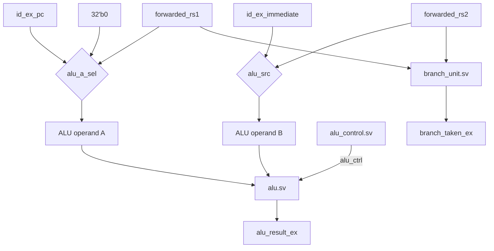

# 06. ALU and Datapath

## 6.1 ALU (`rtl/alu/alu.sv`)

### Interface

```systemverilog
module alu (
    input  logic [31:0] a,
    input  logic [31:0] b,
    input  logic [3:0]  alu_ctrl,
    output logic [31:0] result,
    output logic        zero
);
```

A single combinational ALU, shared by every instruction class that needs arithmetic/logic (R-type, I-type ALU, address calculation for loads/stores, `LUI`/`AUIPC` add, and `JALR` target base — the branch target itself is *not* computed through this ALU; see [10_Control_Hazards.md](10_Control_Hazards.md)).

### Operation Table

```systemverilog
case (alu_ctrl)
    4'b0000: result = a + b;                                     // ADD
    4'b0001: result = a - b;                                     // SUB
    4'b0010: result = a & b;                                     // AND
    4'b0011: result = a | b;                                     // OR
    4'b0100: result = a ^ b;                                     // XOR
    4'b0101: result = a << b[4:0];                               // SLL
    4'b0110: result = a >> b[4:0];                               // SRL
    4'b0111: result = $signed(a) >>> b[4:0];                     // SRA
    4'b1000: result = ($signed(a) < $signed(b)) ? 32'd1 : 32'd0; // SLT
    4'b1001: result = (a < b) ? 32'd1 : 32'd0;                   // SLTU
    default: result = 32'h00000000;
endcase
```

| `alu_ctrl` | Operation | Notes |
|---|---|---|
| `0000` | ADD | Also used for address calculation and `LUI`/`AUIPC` |
| `0001` | SUB | Also assigned (unused functionally) for branch instructions |
| `0010` | AND | |
| `0011` | OR | |
| `0100` | XOR | |
| `0101` | SLL | Shift amount taken from `b[4:0]` only, matching RV32I's 5-bit shift-amount field |
| `0110` | SRL | Logical right shift |
| `0111` | SRA | Arithmetic right shift, using `$signed()` cast on operand `a` |
| `1000` | SLT | Signed less-than compare, `$signed()` cast on both operands |
| `1001` | SLTU | Unsigned less-than compare |

`zero` (`assign zero = (result == 32'b0);`) is computed but is not consumed anywhere in `top.sv` — there is no dedicated `BEQ`-via-`ALU-zero` datapath in this design; branch conditions are evaluated independently by `branch_unit` (§6.4). This is a vestigial output from the classic textbook ALU interface, kept for interface completeness but functionally unused.

## 6.2 ALU Control (`rtl/decoder/alu_control.sv`)

### Interface

```systemverilog
module alu_control (
    input  logic [1:0] alu_op,
    input  logic [2:0] funct3,
    input  logic [6:0] funct7,
    output logic [3:0] alu_ctrl
);
```

This module exists to keep `control_unit` opcode-only: `control_unit` decides *that* an instruction needs the ALU and in what general mode (`alu_op`), and `alu_control` refines that into the specific 4-bit ALU operation using `funct3`/`funct7`, which are only meaningful within the R-type/I-type ALU opcode classes.

```systemverilog
case (alu_op)
    2'b00: alu_ctrl = 4'b0000;   // LW, SW, JALR, LUI, AUIPC -> ADD
    2'b01: alu_ctrl = 4'b0001;   // Branches -> SUB (unused, see 6.1)

    2'b10, 2'b11: begin          // R-type / I-type
        case (funct3)
            3'b000: alu_ctrl = (funct7 == 7'b0100000) ? 4'b0001 : 4'b0000; // SUB / ADD(I)
            3'b001: alu_ctrl = 4'b0101; // SLL(I)
            3'b010: alu_ctrl = 4'b1000; // SLT(I)
            3'b011: alu_ctrl = 4'b1001; // SLTU / SLTIU
            3'b100: alu_ctrl = 4'b0100; // XOR(I)
            3'b101: alu_ctrl = (funct7 == 7'b0100000) ? 4'b0111 : 4'b0110; // SRA(I) / SRL(I)
            3'b110: alu_ctrl = 4'b0011; // OR(I)
            3'b111: alu_ctrl = 4'b0010; // AND(I)
            default: alu_ctrl = 4'b0000;
        endcase
    end

    default: alu_ctrl = 4'b0000;
endcase
```

The `funct3 == 3'b000` and `funct3 == 3'b101` cases are the two places RV32I overloads a single `funct3` value across two different operations, distinguished by bit 30 of the instruction (`funct7[5]`, i.e. `funct7 == 7'b0100000`): `ADD`/`SUB` share `funct3 = 000`, and `SRL`/`SRA` share `funct3 = 101`. Because `alu_op` is `10` for R-type and `11` for I-type but both branches of the outer case share the identical inner `funct3`/`funct7` logic (`2'b10, 2'b11: begin ... end`), the same decode table correctly handles `SRLI`/`SRAI` using their `funct7`-encoded shift-type bit exactly as it handles `SRL`/`SRA` — this is intentional, not accidental sharing, since RV32I defines the I-type shift instructions with the same `funct7`-in-bit-30 convention as their R-type counterparts.

## 6.3 ALU Operand Selection (`top.sv`)

### Operand A

```systemverilog
localparam ALU_A_RS1  = 2'b00;
localparam ALU_A_PC   = 2'b01;
localparam ALU_A_ZERO = 2'b10;

always_comb begin
    case (id_ex_alu_a_sel)
        ALU_A_RS1:  alu_operand_a = forwarded_rs1;
        ALU_A_PC:   alu_operand_a = id_ex_pc;
        ALU_A_ZERO: alu_operand_a = 32'b0;
        default:    alu_operand_a = forwarded_rs1;
    endcase
end
```

| `alu_a_sel` | Source | Used By |
|---|---|---|
| `RS1` (default) | `forwarded_rs1` (post-forwarding rs1 value) | Almost all instructions |
| `PC` | `id_ex_pc` | `AUIPC` (`rd = PC + immediate`) |
| `ZERO` | Constant 0 | `LUI` (`rd = 0 + immediate = immediate`) |

`LUI` is implemented as an ADD of zero and the immediate rather than as a dedicated pass-through path — this reuses the existing ALU/operand-mux hardware instead of adding a fifth writeback source, at the cost of one wasted adder input per `LUI` execution.

### Operand B

```systemverilog
assign alu_operand_b =
    id_ex_alu_src
        ? id_ex_immediate
        : forwarded_rs2;
```

A single mux: `alu_src = 1` selects the immediate (I-type ALU, loads, stores, `JALR`, `LUI`, `AUIPC`); `alu_src = 0` selects the forwarded rs2 value (R-type ALU, branches — though branches do not use the ALU result at all, per §6.1).

## 6.4 Branch Unit (`rtl/core/branch_unit.sv`)

### Interface

```systemverilog
module branch_unit (
    input  logic [31:0] rs1_data,
    input  logic [31:0] rs2_data,
    input  logic [2:0]  funct3,
    input  logic        branch,
    output logic        branch_taken
);
```

This is a second, independent comparator, separate from the ALU, that directly evaluates all six RV32I branch conditions from the (forwarded) `rs1`/`rs2` operand values:

```systemverilog
case (funct3)
    3'b000: branch_taken = (rs1_data == rs2_data);                           // BEQ
    3'b001: branch_taken = (rs1_data != rs2_data);                           // BNE
    3'b100: branch_taken = ($signed(rs1_data) <  $signed(rs2_data));         // BLT
    3'b101: branch_taken = ($signed(rs1_data) >= $signed(rs2_data));         // BGE
    3'b110: branch_taken = (rs1_data < rs2_data);                            // BLTU
    3'b111: branch_taken = (rs1_data >= rs2_data);                           // BGEU
    default: branch_taken = 1'b0;
endcase
```

`rs1_data`/`rs2_data` are wired from `forwarded_rs1`/`forwarded_rs2` in `top.sv` — i.e., the branch unit sees the same post-forwarding operand values the ALU does, so a branch that depends on a value produced by an immediately preceding instruction is still evaluated correctly without needing a separate forwarding path.

Choosing to implement branch comparison as dedicated combinational logic, rather than deriving it from the ALU's `SUB` result and `zero` flag, avoids overloading the ALU's single-cycle critical path with both an arithmetic result and every comparison operator, and keeps the comparator logic self-contained and easy to verify independently (see [10_Control_Hazards.md](10_Control_Hazards.md) for how `branch_taken` feeds the control-flow redirect).

## 6.5 Datapath Summary Diagram



## 6.6 Failure Modes and Verification

| Failure Mode | Symptom | Caught By |
|---|---|---|
| Wrong `alu_ctrl` mapping for a `funct3`/`funct7` pair | Wrong result for one specific ALU operation while others remain correct | `alu.hex` directed test, differential verification |
| `SRL`/`SRA` or `ADD`/`SUB` funct7 disambiguation swapped | Shift direction or add/sub sign inverted for exactly those two overloaded encodings | Directed ALU test with both variants present, differential verification |
| Branch condition inverted or swapped (e.g. `BGE` implemented as `BLT`) | Branch taken/not-taken decision flipped for that specific condition | `branches.hex`, which specifically exercises all six conditions |
| `alu_a_sel`/`alu_src` mux miswired | `LUI`/`AUIPC` produce wrong values while ordinary ALU ops remain correct | Differential verification catches any wrong committed register value regardless of root cause |

## 6.7 Related Tests

- `tests/directed/alu.hex` — R-type/I-type ALU coverage
- `tests/directed/branches.hex` — all six branch conditions
- `tests/directed/beq_taken.hex`, `beq_not_taken.hex` — both directions of one branch condition
- `tests/directed/full_regression.hex` — composite coverage including `LUI`/`AUIPC` if present in that program
