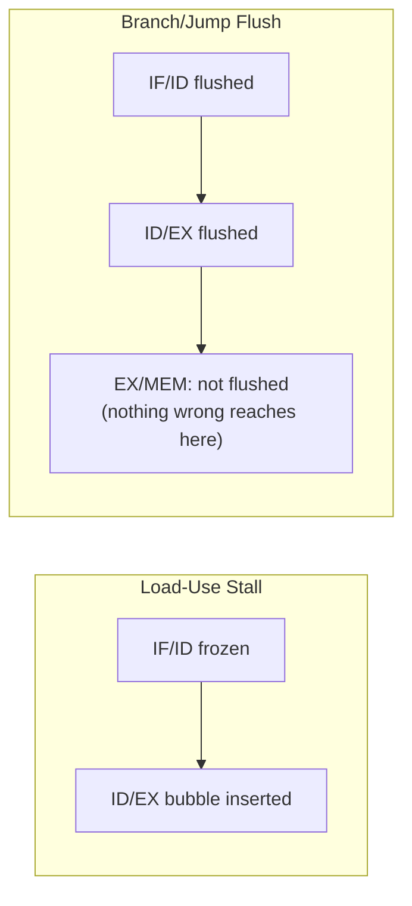

# 07. Pipeline Registers

## 7.1 Purpose

Each pipeline register (`if_id`, `id_ex`, `ex_mem`, `mem_wb`) is a synchronous, positive-edge-triggered SystemVerilog module in `rtl/pipeline/`. Their job is to carry an instruction's data and control signals forward by exactly one pipeline stage per clock edge, and to provide the two mechanisms needed for correct pipelining: **stalling** (freeze in place) and **flushing** (replace with a bubble).

All four registers share the same shape of `always_ff @(posedge clk or posedge rst)` block: a reset/flush branch that forces a NOP-equivalent state, and a normal-advance branch that latches every input to its corresponding output.

## 7.2 IF/ID Register (`rtl/pipeline/if_id.sv`)

```systemverilog
module if_id (
    input  logic        clk, rst, write_enable, flush,
    input  logic        valid_in,
    input  logic [31:0] pc_in,
    input  logic [31:0] instruction_in,
    output logic        valid_out,
    output logic [31:0] pc_out,
    output logic [31:0] instruction_out
);

always_ff @(posedge clk or posedge rst) begin
    if (rst) begin
        valid_out <= 1'b0;
        pc_out <= 32'b0;
        instruction_out <= 32'h00000013;
    end
    else if (flush) begin
        valid_out <= 1'b0;
        pc_out <= 32'b0;
        instruction_out <= 32'h00000013;
    end
    else if (write_enable) begin
        valid_out <= valid_in;
        pc_out <= pc_in;
        instruction_out <= instruction_in;
    end
end
endmodule
```

| Field | Contents |
|---|---|
| `valid_out` | Whether this pipeline slot holds a real instruction |
| `pc_out` | PC of the fetched instruction |
| `instruction_out` | Raw 32-bit fetched instruction word |

This is the only pipeline register with a `write_enable` input — because it is the only register the **hazard unit** needs to freeze (during a load-use stall, the instruction sitting in ID must not be overwritten by the next fetch; see [08_Hazard_Detection.md](08_Hazard_Detection.md)). On both reset and flush, `instruction_out` is forced to `32'h00000013` — the RV32I encoding of `ADDI x0, x0, 0`, i.e. the canonical RISC-V NOP — rather than all-zeros. This matters: an all-zero instruction word (`0x00000000`) is *not* a valid RV32I opcode (opcode field `0000000` matches no case in `control_unit.sv`'s decode, though it would still fall through harmlessly to the `default:` no-op case). Using the real NOP encoding is a defensive choice — a bubble in this design is architecturally indistinguishable from a real, harmless instruction, rather than relying on the decoder's default-case fallback to make an all-zero word inert. This choice becomes important in [12_CPP_Golden_Model.md](12_CPP_Golden_Model.md), where the C++ model's own memory-padding behavior must match this exactly for differential verification to remain valid past the end of a program.

## 7.3 ID/EX Register (`rtl/pipeline/id_ex.sv`)

This is the largest pipeline register — it carries everything the EX, MEM, and WB stages will need, because once an instruction leaves ID, `control_unit`'s outputs are gone; every downstream signal must already be riding in this register.

| Category | Fields |
|---|---|
| Trace / commit | `valid`, `pc`, `instr`, `pc_plus4` |
| Operand data | `rs1_data`, `rs2_data`, `immediate`, `rs1`, `rs2`, `rd` (register addresses), `funct3`, `funct7` |
| EX control | `alu_src`, `alu_op`, `alu_a_sel` |
| MEM control | `mem_read`, `mem_write`, `branch` |
| Control-flow | `jump`, `jalr` |
| WB control | `reg_write`, `wb_sel` |

```systemverilog
if (rst || flush) begin
    pc_out <= 32'b0;
    instr_out <= 32'h00000013; // NOP
    ...
    alu_src_out <= 1'b0;
    alu_op_out <= 2'b00;
    ...
    mem_read_out <= 1'b0;
    mem_write_out <= 1'b0;
    branch_out <= 1'b0;
    jump_out <= 1'b0;
    jalr_out <= 1'b0;
    reg_write_out <= 1'b0;
    wb_sel_out <= 2'b00;
end
else begin
    // latch every _in to every _out
end
```

Notice that on flush, **every control signal that could cause a side effect is explicitly zeroed** (`mem_read_out`, `mem_write_out`, `reg_write_out` all forced low) — this is what makes a flushed slot truly inert rather than merely "labeled invalid." Even though `valid_out` is also driven to 0, the design does not rely solely on downstream stages checking `valid` before acting on `mem_read`/`mem_write`/`reg_write` — those signals are independently forced safe. This is a belt-and-suspenders approach: correctness does not depend on every consumer of this register remembering to gate on `valid`.

`id_ex` has no `write_enable` input — it can only be flushed to a bubble or advanced normally, never frozen in place. This is deliberate: only the load-use hazard needs a freeze, and by construction that freeze only ever needs to hold the IF/ID boundary; the bubble it inserts into ID/EX is a one-time event (`id_ex_flush_hazard`), not a hold.

## 7.4 EX/MEM Register (`rtl/pipeline/ex_mem.sv`)

| Category | Fields |
|---|---|
| Trace / commit | `valid`, `pc`, `instr` |
| Data | `alu_result`, `rs2_data` (forwarded store data), `pc_plus4`, `rd` |
| MEM control | `mem_read`, `mem_write` |
| WB control | `reg_write`, `wb_sel` |

Note that `rs2_data_in` here is wired from `forwarded_rs2` in `top.sv`, not the raw `id_ex_rs2_data` — the value carried into MEM for a store is already the fully-forwarded operand, computed in EX. This means a store instruction whose data operand depends on an immediately preceding instruction's result is handled entirely by EX-stage forwarding, with no separate MEM-stage forwarding path required.

The `flush` port on `ex_mem` exists in the module interface but is tied to `1'b0` at the instantiation site in `top.sv` (`.flush (1'b0)`) — this stage is never flushed in the current design, because by the time an instruction reaches EX/MEM, any preceding branch/jump misprediction has already been resolved (control transfers are detected in EX, the same stage this register's inputs come from, and the flush targets IF/ID and ID/EX, which are *earlier* in program order relative to the redirecting instruction — see [10_Control_Hazards.md](10_Control_Hazards.md)). Consequently no instruction that reaches EX/MEM is ever discovered to be on a mis-speculated path in this design.

## 7.5 MEM/WB Register (`rtl/pipeline/mem_wb.sv`)

| Category | Fields |
|---|---|
| Trace / commit | `valid`, `pc`, `instr` |
| Data | `alu_result`, `mem_data`, `pc_plus4`, `rd` |
| WB control | `reg_write`, `wb_sel` |

This is the simplest of the four registers — it has no `flush` port at all (only `rst`), since, as established in §7.4, nothing reaching this boundary is ever invalidated after the fact in this design. `mem_wb_valid`, `mem_wb_pc`, `mem_wb_instr`, `mem_wb_reg_write`, `mem_wb_rd`, and the writeback-muxed value together constitute the entire architectural commit interface exposed at the top of `top.sv` (see [04_Five_Stage_Pipeline.md §4.6](04_Five_Stage_Pipeline.md)).

## 7.6 Register Contents at a Glance

| Register | `valid`/`flush`/`write_enable` ports | Carries control signals? | Can be frozen? | Can be flushed? |
|---|---|---|---|---|
| `if_id` | `valid`, `flush`, `write_enable` | No (raw instruction only) | Yes (`if_id_write`) | Yes (`if_id_flush`) |
| `id_ex` | `valid`, `flush` | Yes (all EX/MEM/WB control) | No | Yes (`id_ex_flush`) |
| `ex_mem` | `valid`, `flush` (tied to 0) | Yes (MEM/WB control) | No | No (flush port unused) |
| `mem_wb` | `valid` only | Yes (WB control) | No | No (no flush port) |

## 7.7 Bubble Propagation Diagram



## 7.8 Failure Modes and Verification

| Failure Mode | Symptom | Caught By |
|---|---|---|
| A control signal forgotten in the reset/flush branch of any register | A flushed/reset bubble silently performs a side effect (e.g. an erroneous register write) | `pipeline_assertions.sv` bubble/flush-consistency checks, differential verification |
| `if_id` bubble encoded as `0x00000000` instead of the NOP encoding | Decoder behavior for a bubble diverges between RTL and C++ model if their padding conventions differ | Differential verification (see [12_CPP_Golden_Model.md](12_CPP_Golden_Model.md) for how the C++ side must match) |
| `write_enable` on `if_id` stuck low | Pipeline permanently stalls after the first load-use hazard | `load_use.hex` directed test, pipeline assertions |
| Missing `valid` propagation | Commit interface reports a stale/incorrect instruction as valid | DPI-C lockstep verification (every cycle checked in real time) |

## 7.9 Related Tests

- `tests/directed/load_use.hex` — exercises IF/ID freeze and ID/EX bubble insertion
- `tests/directed/beq_taken.hex`, `jal.hex`, `jalr.hex` — exercise IF/ID and ID/EX flush
- `tb/assertions/pipeline_assertions.sv` — continuously checks bubble/flush legality across all directed tests
