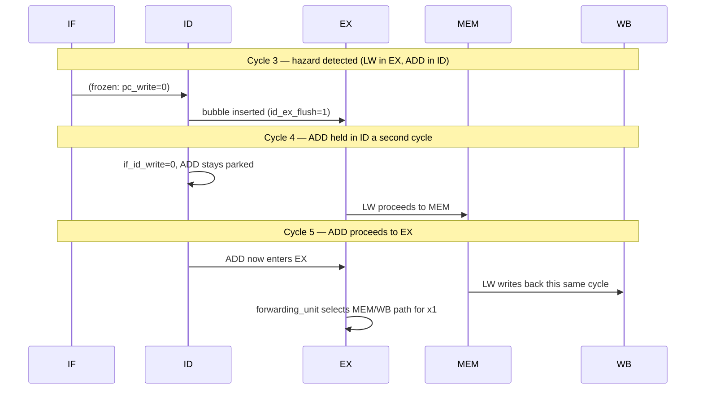
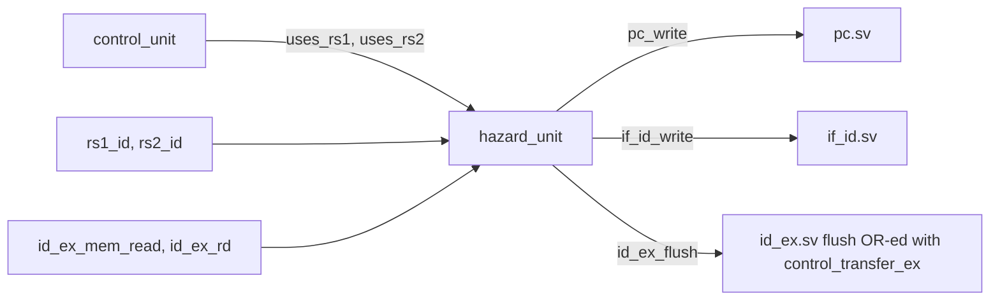

# 08. Hazard Detection

## 8.1 What Hazard This Design Actually Has

In a single-issue, in-order, 5-stage pipeline with full forwarding from EX/MEM and MEM/WB back into EX (see [09_Forwarding.md](09_Forwarding.md)), almost every data hazard is resolved by forwarding alone, with zero stall cycles. Exactly **one** hazard class survives forwarding and requires a stall: the **load-use hazard**.

The load-use hazard occurs when an instruction immediately following a load depends on that load's result. The load's data does not exist until the *end* of its MEM stage — it cannot be forwarded to the very next instruction's EX stage, because that EX stage happens one cycle *before* the load reaches MEM:

```
cycle:        1     2     3     4     5
LW  x1, 0(x2) IF    ID    EX    MEM   WB
ADD x3, x1,x4       IF    ID    EX    ...   <- needs x1 from LW, but LW's
                                               data isn't ready until end of MEM (cycle 4)
```

No structural hazards exist in this design (there is one instruction memory port and one data memory port, accessed by different pipeline stages in different cycles by construction), and no WAW/WAR hazards exist either, since the pipeline is strictly in-order, single-issue, and writes to the register file happen in program order in WB.

## 8.2 Hazard Unit (`rtl/hazard/hazard_unit.sv`)

### Interface

```systemverilog
module hazard_unit (
    input  logic       id_ex_mem_read,
    input  logic [4:0] id_ex_rd,
    input  logic [4:0] if_id_rs1,
    input  logic [4:0] if_id_rs2,
    input  logic       if_id_uses_rs1,
    input  logic       if_id_uses_rs2,
    output logic       pc_write,
    output logic       if_id_write,
    output logic       id_ex_flush
);
```

The module looks at the instruction currently in EX (`id_ex_mem_read`, `id_ex_rd` — i.e. "is this a load, and what register does it write?") against the instruction currently in ID (`if_id_rs1`/`if_id_rs2`, gated by whether that instruction actually reads those operands at all). This is a one-stage lookahead: the hazard is detected while the load is still in EX and the dependent instruction is still in ID, one cycle before the dependent instruction would otherwise reach EX and need the (not-yet-available) value.

### Detection Logic

```systemverilog
load_use_hazard =
    id_ex_mem_read &&
    (id_ex_rd != 5'd0) &&
    (
        (if_id_uses_rs1 && (id_ex_rd == if_id_rs1)) ||
        (if_id_uses_rs2 && (id_ex_rd == if_id_rs2))
    );
```

Three conditions must all hold:

1. `id_ex_mem_read` — the instruction in EX is a load.
2. `id_ex_rd != 5'd0` — its destination is not `x0` (a load into `x0` cannot create a hazard, since `x0` is always read as zero regardless of any write).
3. Either `if_id_uses_rs1` and the ID-stage instruction's rs1 matches the load's rd, or the same for rs2 — gated by `uses_rs1`/`uses_rs2` from `control_unit`, so that, for example, a `LUI` in ID (which does not read `rs1` at all) is never flagged as hazardous even if its raw `if_id_instruction[19:15]` bit field happens to numerically equal the load's `rd`.

### Response

```systemverilog
pc_write    = 1'b1;
if_id_write = 1'b1;
id_ex_flush = 1'b0;

if (load_use_hazard) begin
    pc_write    = 1'b0;
    if_id_write = 1'b0;
    id_ex_flush = 1'b1;
end
```

On detection: `pc_write = 0` freezes the PC (so the same instruction is re-fetched into IF next cycle rather than being lost), `if_id_write = 0` freezes the IF/ID register (so the dependent instruction stays parked in ID rather than advancing before its operand is ready), and `id_ex_flush = 1` inserts a bubble into ID/EX for exactly one cycle (so EX executes a NOP instead of prematurely running the dependent instruction with stale operands).

## 8.3 Cycle-by-Cycle Walkthrough

```
LW  x1, 0(x2)     ADD x3, x1, x4
------------------------------------------------------------
Cycle 1:  IF(LW)
Cycle 2:  ID(LW)   IF(ADD)
Cycle 3:  EX(LW)   ID(ADD)  <-- hazard detected here: id_ex_mem_read=1,
                                 id_ex_rd=x1, if_id_rs1=x1 -> load_use_hazard=1
Cycle 4:  MEM(LW)  ID(ADD)  <-- ADD held in ID (if_id_write=0),
                    bubble    a bubble (NOP) enters EX instead of ADD
Cycle 5:  WB(LW)   EX(ADD)  <-- ADD now in EX; x1 is forwarded from
                                 MEM/WB (LW just wrote back) via forwarding_unit
```

The stall lasts exactly one cycle because, by the time `ADD` re-enters EX in cycle 5, `LW` has just completed WB in the same cycle, making its result available through the MEM/WB→EX forwarding path (see [09_Forwarding.md](09_Forwarding.md)) rather than requiring `ADD` to wait for a register-file read after the write has committed.

## 8.4 Load-Use Stall Diagram



## 8.5 Interaction With Neighboring Modules



Note in `top.sv`:

```systemverilog
assign id_ex_flush =
    id_ex_flush_hazard |
    control_transfer_ex;
```

`id_ex_flush_hazard` (from the hazard unit) and `control_transfer_ex` (from branch/jump resolution, see [10_Control_Hazards.md](10_Control_Hazards.md)) are OR-ed into a single `id_ex_flush` signal — the `id_ex` register itself does not distinguish *why* it is being flushed, it simply inserts a bubble either way. This is a clean separation of concerns: `id_ex.sv` only needs to know "flush or don't," while the reason lives entirely in `top.sv`'s combinational logic.

## 8.6 Failure Modes and Verification

| Failure Mode | Symptom | Caught By |
|---|---|---|
| Hazard not detected (missing condition) | `ADD` reads stale register-file value instead of the load's result | `load_use.hex` directed test — final register value would be wrong |
| Hazard detected when it shouldn't be (false positive, e.g. ignoring `uses_rs1`) | Unnecessary stall cycle inserted, degrading performance but not correctness | Would still pass functional regression; only visible via cycle-count/waveform inspection |
| `pc_write`/`if_id_write` desynchronized (one freezes, the other doesn't) | PC advances but IF/ID doesn't (or vice versa), corrupting the fetch stream | `pipeline_assertions.sv` stall-consistency checks |
| `id_ex_flush_hazard` fails to also zero side-effecting control signals | A stale/duplicate instruction executes twice | `pipeline_assertions.sv`, differential verification |
| `x0` special case omitted | A load into `x0` incorrectly triggers a stall | Would only surface as a performance issue, not a correctness one, since `x0` reads as zero regardless |

## 8.7 Related Tests

- `tests/directed/load_use.hex` — the single test purpose-built to exercise this exact hazard
- `tests/directed/full_regression.hex` — likely re-exercises the same hazard within a larger composite program
- `tb/assertions/pipeline_assertions.sv` — checks stall/freeze legality on every cycle of every test, not just `load_use.hex`
