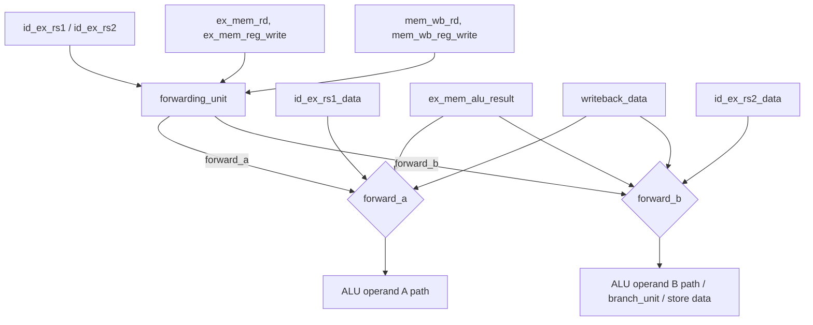

# 09. Forwarding

## 9.1 Purpose

Without forwarding, every instruction that depends on the immediately preceding instruction's result would have to stall until that result is written back to the register file — in this pipeline, that would mean a 2–3 cycle bubble for nearly every dependent instruction, since results are not available until MEM (loads) or the end of EX (ALU ops), while dependent instructions need their operands at the *start* of EX.

`forwarding_unit.sv` eliminates almost all of these stalls by routing results from later pipeline stages directly back into the EX-stage ALU operand muxes, bypassing the register file entirely for back-to-back dependent instructions. The only case forwarding cannot solve is the load-use hazard (§8), because the load's data literally does not exist yet at the point forwarding would need to supply it.

## 9.2 Interface

```systemverilog
module forwarding_unit (
    input  logic [4:0] id_ex_rs1,
    input  logic [4:0] id_ex_rs2,
    input  logic [4:0] ex_mem_rd,
    input  logic       ex_mem_reg_write,
    input  logic [4:0] mem_wb_rd,
    input  logic       mem_wb_reg_write,
    output logic [1:0] forward_a,
    output logic [1:0] forward_b
);
```

The unit looks at the source registers of the instruction currently in EX (`id_ex_rs1`/`id_ex_rs2`) against the destination registers of the instructions currently in MEM (`ex_mem_rd`) and WB (`mem_wb_rd`), and produces a 2-bit select per operand.

## 9.3 Forwarding Priority Logic

```systemverilog
// Default: no forwarding
forward_a = 2'b00;
forward_b = 2'b00;

// EX/MEM -> EX forwarding (highest priority)
if (ex_mem_reg_write && (ex_mem_rd != 5'd0) && (ex_mem_rd == id_ex_rs1))
    forward_a = 2'b10;

if (ex_mem_reg_write && (ex_mem_rd != 5'd0) && (ex_mem_rd == id_ex_rs2))
    forward_b = 2'b10;

// MEM/WB -> EX forwarding (only if EX/MEM isn't already forwarding)
if (mem_wb_reg_write && (mem_wb_rd != 5'd0) &&
    !(ex_mem_reg_write && (ex_mem_rd != 5'd0) && (ex_mem_rd == id_ex_rs1)) &&
    (mem_wb_rd == id_ex_rs1))
    forward_a = 2'b01;

if (mem_wb_reg_write && (mem_wb_rd != 5'd0) &&
    !(ex_mem_reg_write && (ex_mem_rd != 5'd0) && (ex_mem_rd == id_ex_rs2)) &&
    (mem_wb_rd == id_ex_rs2))
    forward_b = 2'b01;
```

| Encoding | Meaning | Source |
|---|---|---|
| `2'b00` | No forwarding | Register-file value (as latched in ID/EX) |
| `2'b10` | Forward from EX/MEM | `ex_mem_alu_result` |
| `2'b01` | Forward from MEM/WB | `writeback_data` (the already-muxed WB value) |

### Why EX/MEM Takes Priority

The explicit `!(ex_mem_reg_write && ... && (ex_mem_rd == id_ex_rs1))` guard in the MEM/WB condition is what enforces priority — it is not implicit in `if`/`else if` ordering here (both are independent `if` statements), so this guard is the only thing preventing both conditions from being true simultaneously and creating a race. This matters for the standard "three instructions in a row write and read the same register" case:

```
ADD x1, x2, x3      <- writes x1 (in MEM during cycle 3)
ADD x1, x1, x4      <- also writes x1 (in WB during cycle 3, from an earlier write) and reads x1
ADD x5, x1, x6      <- reads x1, needs the *second* ADD's result, not the first's
```

If `x1` is being written by both an instruction in EX/MEM and an instruction in MEM/WB in the same cycle (because two instructions in flight both target `x1`), the EX/MEM value is architecturally the more recent write — program order guarantees the instruction now in EX/MEM was fetched after the one now in MEM/WB. Taking the EX/MEM value in this case is what makes the forwarding logic correct under back-to-back same-register writes, not just single dependencies.

## 9.4 Forwarding Condition Table

| Condition | `forward_a`/`forward_b` | Meaning |
|---|---|---|
| `ex_mem_reg_write & (ex_mem_rd≠0) & (ex_mem_rd == id_ex_rs1/2)` | `2'b10` | EX/MEM instruction's ALU result forwarded (highest priority) |
| `mem_wb_reg_write & (mem_wb_rd≠0) & (mem_wb_rd == id_ex_rs1/2)` **and** EX/MEM condition above is false | `2'b01` | MEM/WB instruction's writeback value forwarded |
| Neither condition holds | `2'b00` | Use the value already latched in ID/EX (either a true non-dependency, or `rd == x0`, which never forwards) |

## 9.5 Consumption in `top.sv`

```systemverilog
always_comb begin
    case (forward_a)
        2'b00:   forwarded_rs1 = id_ex_rs1_data;
        2'b10:   forwarded_rs1 = ex_mem_alu_result;
        2'b01:   forwarded_rs1 = writeback_data;
        default: forwarded_rs1 = id_ex_rs1_data;
    endcase
end
```

(Identical structure for `forwarded_rs2`/`forward_b`.) Two things worth noting:

1. **Encoding order looks unusual** — `2'b10` maps to EX/MEM and `2'b01` maps to MEM/WB, which is a common convention (bit 1 = "more recent/EX-MEM", bit 0 = "less recent/MEM-WB") but is easy to transpose by mistake; the case statement in `top.sv` and the assignments in `forwarding_unit.sv` must stay in agreement, which was confirmed by direct comparison of both files.
2. **`writeback_data` is used, not `mem_wb_alu_result` directly** — for MEM/WB forwarding, the *already-muxed* writeback value is forwarded, not the raw ALU result field of the MEM/WB register. This is what makes MEM/WB forwarding correct for loads (`wb_sel = WB_MEM`) and `JAL`/`JALR` (`wb_sel = WB_PC4`) as well as ordinary ALU instructions — a naive implementation that only forwarded `mem_wb_alu_result` would silently forward the wrong value for any load or jump-and-link instruction one cycle behind a dependent instruction.

`forwarded_rs1`/`forwarded_rs2` are then used in three places: the ALU operand A/B muxes (§6.3), the branch unit's comparison inputs (§6.4), and the EX/MEM register's `rs2_data_in` (store data, §7.4) — a single pair of signals serves as the canonical "correct, forwarded" operand values for the entire EX stage.

## 9.6 Forwarding Path Diagram



## 9.7 What Forwarding Does Not Cover

Forwarding into EX handles every case where the producing instruction's result exists by the time the consuming instruction needs it in EX — that is, the producer is 1 or 2 instructions ahead and is not itself a load. It explicitly does not, and cannot, cover:

- **Load-use** (producer is a load one instruction ahead) — the load's data isn't ready until MEM, one cycle later than EX-stage forwarding can supply it. Handled instead by the stall in [08_Hazard_Detection.md](08_Hazard_Detection.md).
- **Store data more than one instruction removed and also load-dependent** — not a distinct hazard in this design; ordinary EX/MEM and MEM/WB forwarding covers store-data dependencies exactly like any other rs2 dependency, since stores read `forwarded_rs2` (§7.4).

## 9.8 Failure Modes and Verification

| Failure Mode | Symptom | Caught By |
|---|---|---|
| EX/MEM and MEM/WB priority reversed | Wrong value forwarded when two in-flight instructions both target the same register | `forwarding.hex` directed test, differential verification |
| `x0` exclusion omitted (`ex_mem_rd != 5'd0` dropped) | An instruction with `rd = x0` incorrectly triggers a forward, corrupting an unrelated operand that happens to also be `x0`-numbered in the encoding | Would surface as an incorrect value in any test with an `x0`-writing instruction adjacent to a dependent instruction |
| `writeback_data` swapped for raw `mem_wb_alu_result` | Loads/jumps forward the wrong value one cycle late | `load_use.hex`, `jal.hex`, `jalr.hex` combined with `forwarding.hex`-style adjacency |
| Forwarding encoding (`2'b01`/`2'b10`) transposed between `forwarding_unit.sv` and the mux in `top.sv` | Every forwarded value in the whole design is swapped between "one cycle old" and "two cycles old" sources | Any test exercising back-to-back dependent instructions; would fail broadly across the whole regression suite, not in an isolated way |

## 9.9 Related Tests

- `tests/directed/forwarding.hex` — purpose-built to exercise both EX/MEM and MEM/WB forwarding paths
- `tests/directed/full_regression.hex` — re-exercises forwarding within a larger composite program
- `tb/assertions/pipeline_assertions.sv` — includes forwarding-mux legality and priority assertions (see [15_Testing.md](15_Testing.md))
