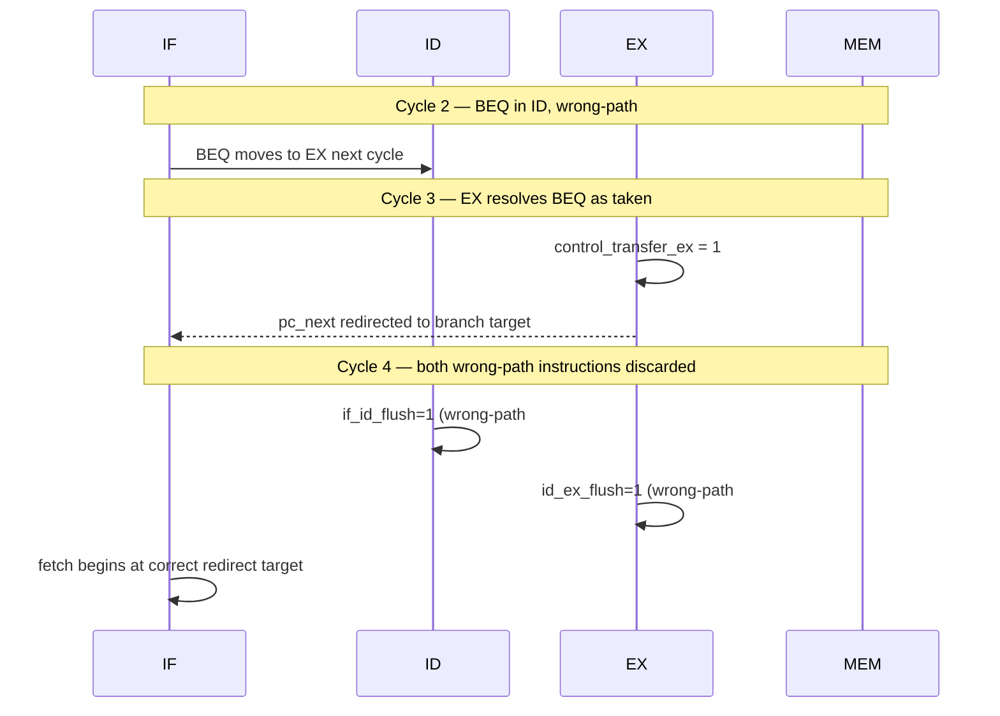

# 10. Control Hazards

## 10.1 The Problem

The pipeline fetches instructions sequentially (`pc_plus4_if`) before it knows whether the instruction currently in EX is actually a taken branch or a jump. By the time `control_transfer_ex` becomes true, the pipeline has already fetched (into IF) and decoded (into ID) the two sequential instructions immediately following the branch/jump — both of which are on the *wrong* path if the branch is taken or the jump is unconditional. These must be discarded (flushed) rather than allowed to execute.

This design resolves every branch and jump in the EX stage and uses no branch prediction — every taken control transfer costs exactly a 2-cycle flush penalty, and every not-taken branch costs nothing.

## 10.2 Control-Flow Resolution (`top.sv`)

```systemverilog
logic branch_taken_ex;
logic control_transfer_ex;
logic [31:0] branch_target_ex;
logic [31:0] jalr_target_ex;
logic [31:0] redirect_target_ex;

assign branch_target_ex = id_ex_pc + id_ex_immediate;

assign jalr_target_ex =
    (forwarded_rs1 + id_ex_immediate) & 32'hFFFFFFFE;

assign control_transfer_ex =
    (id_ex_branch && branch_taken_ex)
    || id_ex_jump;

always_comb begin
    if (id_ex_jalr)
        redirect_target_ex = jalr_target_ex;
    else
        redirect_target_ex = branch_target_ex;
end
```

| Signal | Computation | Applies To |
|---|---|---|
| `branch_target_ex` | `id_ex_pc + id_ex_immediate` | Branches, `JAL` (both are PC-relative) |
| `jalr_target_ex` | `(forwarded_rs1 + id_ex_immediate) & ~1` | `JALR` only |
| `control_transfer_ex` | `(branch AND taken) OR jump` | Any instruction that actually redirects control flow |
| `redirect_target_ex` | `jalr_target_ex` if `JALR`, else `branch_target_ex` | Selects which target computation applies |

Two details worth explaining:

- **`branch_target_ex` doubles as the `JAL` target.** `JAL`'s target is architecturally `PC + immediate`, identical in form to a taken branch's target; the same adder expression serves both, distinguished only by which instruction reaches EX (`branch_target_ex` is computed unconditionally every cycle regardless of instruction type — it is only *used* when `control_transfer_ex` is true).
- **`JALR`'s target clears bit 0** (`& 32'hFFFFFFFE`) per the RV32I specification, which defines the `JALR` target as `(rs1 + imm) & ~1` to guarantee a 2-byte-aligned result even though `rs1 + imm` could be odd.
- **`jalr_target_ex` uses `forwarded_rs1`, not `id_ex_rs1_data`** — this is the same forwarded operand used by the ALU (§6.3), meaning a `JALR` whose base register was just computed by an immediately preceding instruction is correctly forwarded before its target is calculated, with no separate forwarding path needed for this specific case.

## 10.3 Next-PC Selection

```systemverilog
always_comb begin
    pc_next = pc_plus4_if;
    if (control_transfer_ex)
        pc_next = redirect_target_ex;
end
```

Normally the next PC is simply the current PC plus 4. If EX determines that the instruction there is a taken branch or any jump, `pc_next` is overridden combinationally to the redirect target — this override happens in the same cycle EX resolves the control transfer, so the very next fetch (the following clock edge) already targets the correct address.

## 10.4 Flush Logic

```systemverilog
assign if_id_flush = control_transfer_ex;
assign id_ex_flush = id_ex_flush_hazard | control_transfer_ex;
```

Both the instruction currently in IF (about to be latched into IF/ID) and the instruction currently in ID (already latched in IF/ID, about to move into ID/EX) are on the wrong path when a redirect happens, so both `if_id_flush` and `id_ex_flush` assert in the same cycle `control_transfer_ex` is true. As shown in [08_Hazard_Detection.md §8.5](08_Hazard_Detection.md), `id_ex_flush` is shared between hazard-stall bubbles and control-transfer flushes — from `id_ex.sv`'s perspective, both simply insert a NOP.

No flush signal reaches `ex_mem` or `mem_wb` (§7.4–7.5): by the time the branch/jump has resolved in EX, nothing past that point in the pipeline (i.e., already in MEM or WB) was fetched *after* it, so nothing downstream is ever on the wrong path.

## 10.5 Cycle-by-Cycle Walkthrough — Taken Branch

```
Address:   0x00  BEQ x1, x2, +8      (taken)
           0x04  ADD x3, x4, x5      <- wrong-path instruction #1
           0x08  ADD x6, x7, x8      <- wrong-path instruction #2
           0x0C  target of branch (skipped over)
           0x10  <actual next instruction after target...>
```

```
Cycle 1:  IF(BEQ @0x00)
Cycle 2:  IF(ADD @0x04)      ID(BEQ)
Cycle 3:  IF(ADD @0x08)      ID(ADD@0x04)     EX(BEQ) <- branch_taken_ex=1,
                                                          control_transfer_ex=1
                                                          pc_next redirected to branch target
Cycle 4:  IF(target @0x0C)   ID:  FLUSHED     EX:  FLUSHED    MEM(BEQ)
                             (if_id_flush=1)  (id_ex_flush=1, absorbs
                                                the ADD@0x04 that had
                                                reached ID)
Cycle 5:  ...                IF(target's      ...             ...       WB(BEQ)
                              next instr)
```

Two wrong-path instructions (`ADD @0x04`, which had reached ID, and `ADD @0x08`, which had reached IF) are discarded in cycle 4. No instruction is lost that shouldn't be — `BEQ` itself continues normally through MEM and WB.

## 10.6 Branch Flush Diagram



## 10.7 JAL vs. JALR vs. Branch — Target Computation Comparison

| Instruction | Target Formula | Computed Via | Always Redirects? |
|---|---|---|---|
| `BEQ`/`BNE`/`BLT`/`BGE`/`BLTU`/`BGEU` | `PC + immediate` | `branch_target_ex` | Only if `branch_taken_ex` |
| `JAL` | `PC + immediate` | `branch_target_ex` (shared expression) | Always (`id_ex_jump = 1`) |
| `JALR` | `(rs1 + immediate) & ~1` | `jalr_target_ex` | Always (`id_ex_jump = 1`, `id_ex_jalr = 1`) |

## 10.8 Failure Modes and Verification

| Failure Mode | Symptom | Caught By |
|---|---|---|
| `control_transfer_ex` fails to include `id_ex_jump` | `JAL`/`JALR` execute but never actually redirect the PC | `jal.hex`, `jalr.hex` directed tests |
| `if_id_flush`/`id_ex_flush` not both asserted together | One wrong-path instruction is discarded but the other executes and corrupts state | `pipeline_assertions.sv` flush-consistency checks, differential verification |
| `JALR`'s bit-0 mask omitted | Odd-valued jump targets, which should never occur architecturally but would misalign fetch if they did | Directed `jalr.hex` test with a target requiring the mask to matter |
| `branch_target_ex` used for `JALR` (formula mismatch) | `JALR` jumps to the wrong address whenever `rs1` differs from `PC` | `jalr.hex` directed test |
| Off-by-one in flush timing (flushing one cycle early/late) | Either a wrong-path instruction executes, or a correct-path instruction is incorrectly discarded | Any test containing a taken branch or jump — would show as an incorrect final register state |

## 10.9 Related Tests

- `tests/directed/beq_taken.hex` — one taken branch, confirms flush occurs and the correct target is reached
- `tests/directed/beq_not_taken.hex` — confirms no flush occurs and execution falls through normally
- `tests/directed/branches.hex` — all six branch conditions, taken and not-taken combinations
- `tests/directed/jal.hex` — unconditional jump, `PC + immediate` target
- `tests/directed/jalr.hex` — unconditional jump, `(rs1 + immediate) & ~1` target
- `tb/assertions/pipeline_assertions.sv` — flush-consistency assertions applied across every directed test
