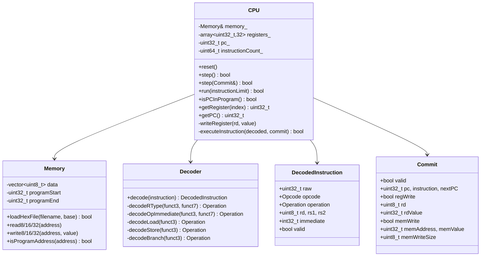

# 12. C++ Golden Model

## 12.1 Purpose and Design Philosophy

The C++ model in `cpp_model/` is a from-scratch, cycle-*inaccurate* but architecturally-*exact* reference implementation of the same RV32I subset as the RTL. "Cycle-inaccurate" here means it has no concept of pipeline stages, stalls, or forwarding — it executes one complete instruction per call to `CPU::step()`, exactly like a simple non-pipelined interpreter. "Architecturally exact" means that the sequence of committed register writes, memory writes, and PC updates it produces must be indistinguishable from what a correct RV32I implementation of this same instruction subset would produce.

This is the entire point of a golden reference model: it does not need to model *how* the RTL pipeline achieves its result, only *what* the correct result should be after each instruction retires. The RTL's pipelining, forwarding, and hazard-stalling machinery exists entirely to make a fundamentally sequential ISA execute faster — from the architectural, commit-point view, the two implementations must agree exactly.

## 12.2 Class Structure



## 12.3 Instruction Decode (`decoder.cpp`)

The decoder is structured as a single dispatch on the 7-bit opcode, delegating to per-format helper functions (`decodeRType`, `decodeOpImmediate`, `decodeLoad`, `decodeStore`, `decodeBranch`) that further dispatch on `funct3`/`funct7`. This mirrors the two-level structure of the RTL (`control_unit.sv` on opcode, `alu_control.sv`/`branch_unit.sv` on `funct3`/`funct7`) even though the two were written independently — a natural consequence of both implementations following the same RV32I encoding structure, not of one copying the other.

### Special-Cased NOP

```cpp
if (instruction == 0x00000013) {
    decoded.opcode    = Opcode::OP_IMM;
    decoded.format    = InstructionFormat::I_TYPE;
    decoded.operation = Operation::NOP;
    decoded.immediate = 0;
    decoded.valid     = true;
    return decoded;
}
```

The decoder special-cases the exact NOP encoding *before* falling into the general opcode switch, even though `0x00000013` (`ADDI x0, x0, 0`) would actually decode correctly as an ordinary `ADDI` through the normal `case 0x13` path. This exists specifically to match RTL behavior at the pipeline-bubble/NOP-padding boundary discussed in [07_Pipeline_Registers.md](07_Pipeline_Registers.md) and [11_Memory_System.md](11_Memory_System.md) — since the RTL pads both flushed pipeline slots and out-of-program instruction memory with this exact encoding, the C++ model needs a corresponding representation, and giving it a distinct `Operation::NOP` (rather than letting it fall through to `ADDI`) makes the trace output and intent explicit, even though the executed effect (`writeRegister` on `x0`, which is always suppressed) would be identical either way.

### Validity Determination

```cpp
decoded.valid = (decoded.operation != Operation::INVALID);
```

An instruction is only `valid` if its `Operation` was successfully resolved — an unrecognized opcode, or a recognized opcode with an unrecognized `funct3`/`funct7` combination, produces `Operation::INVALID`, and `decoded.valid` becomes `false`. Unlike the RTL, where an unsupported opcode silently falls through to a no-op `default:` case (§5.3), the C++ model treats an invalid decode as a hard failure: `CPU::step()` prints an error and returns `false`, halting execution entirely. This is a deliberate divergence in strictness, not an oversight — the golden model is meant to be strict about what it will execute, since silently ignoring bad instructions in the reference model would defeat the purpose of using it to catch RTL bugs. See [19_Limitations.md](19_Limitations.md) for the implication this has on divergent-behavior programs.

### Byte/Half-Word Load/Store Decode Exists but Is Not Executed

As established in [11_Memory_System.md §11.4](11_Memory_System.md), `decodeLoad`/`decodeStore` correctly produce distinct `Operation::LB/LH/LW/LBU/LHU` and `Operation::SB/SH/SW` values based on `funct3`, and the decoder marks all of them `valid = true`. The gap is entirely downstream, in `CPU::executeInstruction`'s `switch (d.operation)`, which has cases only for `LW` and `SW` — every other load/store operation reaches the `default:` case and fails at execution time, not at decode time.

## 12.4 Execution (`cpu.cpp`)

### `CPU::step(Commit&)` — The Central Method

```cpp
bool CPU::step(Commit& commit)
{
    commit = Commit{};

    uint32_t instruction = memory_.read32(pc_);

    commit.valid       = true;
    commit.pc          = pc_;
    commit.instruction = instruction;
    commit.regWrite    = false;

    DecodedInstruction decoded = Decoder::decode(instruction);

    if (!decoded.valid) {
        commit.valid = false;
        return false;
    }

    if (!executeInstruction(decoded, commit)) {
        commit.valid = false;
        return false;
    }

    registers_[0] = 0;
    ++instructionCount_;
    return true;
}
```

This is the entire architectural cycle: fetch, decode, execute, and populate a `Commit` record — no pipeline, no stages, no cycle count. `registers_[0] = 0` is asserted unconditionally after every instruction, as a defense-in-depth measure alongside `writeRegister`'s own `rd == 0` guard (§12.5) — belt-and-suspenders, matching the same philosophy seen in the RTL's flush logic ([07_Pipeline_Registers.md §7.3](07_Pipeline_Registers.md)).

### `executeInstruction` — Notable Implementation Details

**`JALR` computes its target before writing its link register**, explicitly to handle the `rd == rs1` case correctly:

```cpp
case Operation::JALR: {
    const uint32_t linkAddress = currentPC + 4;

    // IMPORTANT: Calculate target using the OLD rs1 value before
    // writing rd. This matters when rd == rs1.
    const uint32_t targetAddress =
        (rs1Value + static_cast<uint32_t>(d.immediate)) & ~1u;

    writeRegister(d.rd, linkAddress);
    ...
    nextPC = targetAddress;
    break;
}
```

`rs1Value` was already read into a local at the top of `executeInstruction` before any register writes occur in this call, so this ordering is automatically correct in the C++ model. The comment documents *why* it matters (a self-referential `JALR x1, 0(x1)`-style instruction, where the destination and base register are the same), which is exactly the kind of edge case a hand-written directed test might miss but that a golden model needs to get right regardless, since it may be exercised by arbitrary future test programs.

**Comparison and arithmetic operations follow RV32I's signed/unsigned split precisely**, e.g.:

```cpp
case Operation::SLT:
    result = static_cast<int32_t>(rs1Value) < static_cast<int32_t>(rs2Value);
```

```cpp
case Operation::SLTU:
    result = rs1Value < rs2Value;
```

This mirrors the RTL ALU's `$signed()`-cast vs. unsigned comparison split exactly (§6.1) — again, a consequence of both implementations correctly following the same specification rather than one being derived from the other.

**Unsupported operations produce a hard failure**, not a silent no-op:

```cpp
default:
    std::cerr << "Unsupported decoded operation at PC 0x" << ...;
    return false;
```

## 12.5 Register File Semantics

```cpp
void CPU::writeRegister(uint32_t rd, uint32_t value)
{
    if (rd == 0 || rd >= registers_.size()) {
        return;
    }
    registers_[rd] = value;
}

uint32_t CPU::getRegister(uint32_t index) const
{
    if (index >= registers_.size()) return 0;
    if (index == 0) return 0;
    return registers_[index];
}
```

Both the write path (silently ignores writes to `x0`) and the read path (always returns 0 for `x0`, regardless of the underlying array contents) enforce the `x0`-hardwired-to-zero invariant independently, matching the RTL register file's equivalent behavior (§3.4).

## 12.6 The Commit Record — the C++ Analogue of the RTL Commit Interface

```cpp
struct Commit {
    bool valid = false;
    uint32_t pc = 0;
    uint32_t instruction = 0;
    uint32_t nextPC = 0;
    bool regWrite = false;
    uint8_t rd = 0;
    uint32_t rdValue = 0;
    bool memWrite = false;
    uint32_t memAddress = 0;
    uint32_t memValue = 0;
    uint8_t memWriteSize = 0;
};
```

This structure is the single point of correspondence between the C++ model and the RTL's commit interface ([04_Five_Stage_Pipeline.md §4.6](04_Five_Stage_Pipeline.md)) — `pc`, `instruction`, `regWrite`, `rd`, `rdValue` map directly onto `commit_pc`, `commit_instr`, `commit_reg_write`, `commit_rd`, `commit_rd_value`. The `memWrite`/`memAddress`/`memValue`/`memWriteSize` fields exist in this struct and are populated for `SW` in `cpu.cpp`, but the RTL side has **no equivalent memory-commit signals exposed at the top level** — `top.sv`'s commit interface only exposes register-write information, not memory writes. This means the offline differential comparator (`compare_traces.cpp`) can only compare memory-write fields when both sides happen to supply them from a text trace that includes `MEM_ADDR=`/`MEM_VALUE=`/`MEM_SIZE=` fields (per `trace_parser.h`'s documented format), but the RTL trace, as actually emitted by `top.sv`'s `$display` in the current design, does not include these fields at all. In practice this means memory-write correctness is currently verified only indirectly — through the register values that later loads read back from those addresses — not through a direct memory-write commit comparison. This is discussed further in [13_Differential_Verification.md](13_Differential_Verification.md) and [19_Limitations.md](19_Limitations.md).

## 12.7 Natural Termination — `isPCInProgram()`

```cpp
bool CPU::isPCInProgram() const
{
    return memory_.isProgramAddress(pc_);
}
```

This is what allows `trace_main.cpp` and `dpi_bridge.cpp` to run a program to completion without needing to know in advance how many instructions it contains — execution simply continues `while (cpu.isPCInProgram())`. This is a meaningful design choice: an earlier approach (visible in the stale `cpp_regression_new.log`, discussed in [19_Limitations.md](19_Limitations.md)) instead ran a *fixed* instruction count per test, which is fragile — if a program's actual instruction count doesn't exactly match the hardcoded limit, the model either stops early or walks off the end of the program into memory that, at the time that stale log was produced, was not a defined NOP the way the RTL's instruction memory is (§11.7).

## 12.8 Standalone `rv32_ref` Tool (`main.cpp`) — Known Build Issue

`cpp_model/src/main.cpp` implements a standalone command-line reference-model tool separate from `trace_main.cpp`. It is **not used by any regression script** (`run_cpp_regression.sh` uses `test_runner.cpp`; `run_differential.sh` uses `trace_main.cpp`/`compare_traces.cpp`), and it currently fails to compile against the present `cpu.h`:

```
main.cpp:140:18: error: no matching function for call to 'CPU::reset(int)'
cpu.h:28:10: note: candidate: 'void CPU::reset()'
```

`main.cpp` calls `cpu.reset(0)`, but `CPU::reset()` takes no arguments. This was confirmed directly in this session by attempting to compile `main.cpp` against the current sources. Because no verification flow depends on this file, it does not affect the four verification layers' results, but it is dead/broken code as currently checked in — documented fully in [19_Limitations.md](19_Limitations.md).

## 12.9 Related Tests

- `cpp_model/tests/test_runner.cpp` — ten self-checking C++ unit tests against `CPU`/`Decoder`/`Memory` directly (§15)
- `cpp_model/src/trace_main.cpp` — produces the C++-side trace consumed by offline differential verification ([13_Differential_Verification.md](13_Differential_Verification.md))
- `cpp_model/dpi/dpi_bridge.cpp` — drives the same `CPU`/`Memory` classes inside the live DPI-C lockstep flow ([14_DPI_Lockstep_Verification.md](14_DPI_Lockstep_Verification.md))
