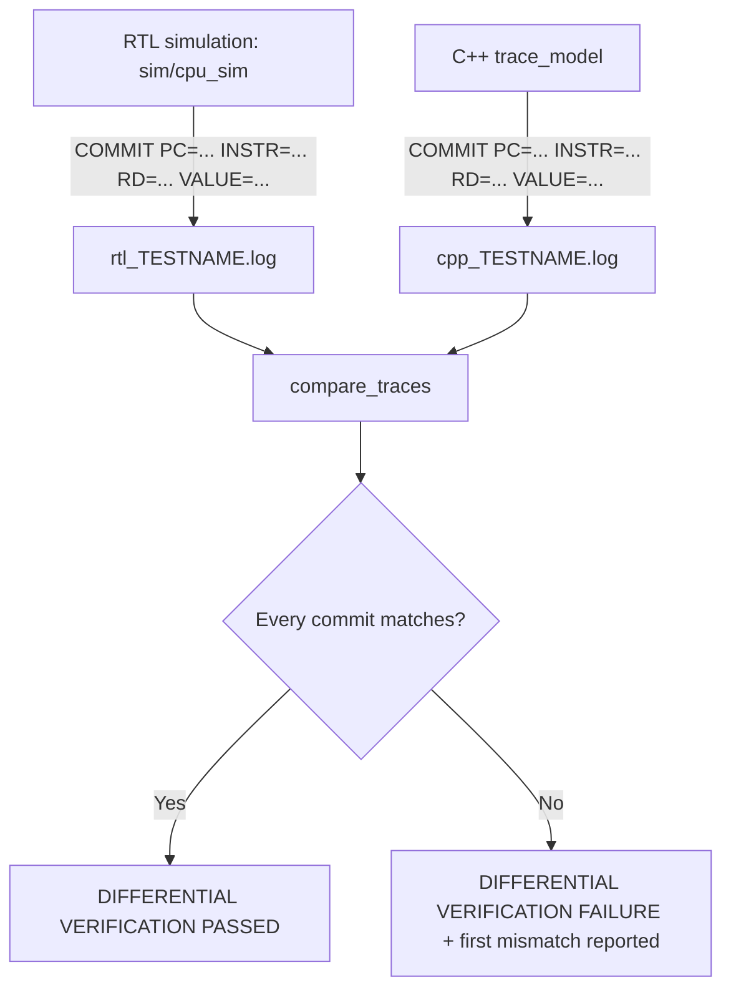

# 13. Differential Verification

## 13.1 Why Offline Differential Verification, in Addition to Directed Tests

The directed RTL testbench (`tb/basic/top_tb.sv`, [15_Testing.md](15_Testing.md)) checks final register values against hand-computed expected values for each of the 10 directed programs. This is valuable but limited: it only tells you the *end state* is correct, and only for the specific values a human anticipated when writing the test.

Offline differential verification instead compares **every single committed instruction**, in program order, between the RTL and an independent C++ golden model — not just the final register state, but the PC, instruction word, and register-write result at every step. This catches a class of bug that final-state-only checking cannot: an intermediate miscalculation that happens to get overwritten or masked by later instructions before the test ends, which would never surface in a final-register-value check but would appear immediately as a mismatch at the exact commit where it occurred.

## 13.2 The Flow



This corresponds to the requested project-level verification pipeline:

```
RTL
    │
Commit
    │
DPI          <- not used in this offline path; see 14_DPI_Lockstep_Verification.md
    │
C++
    │
Comparison
    │
PASS
```

For the *offline* path specifically, the RTL and C++ traces are generated in two entirely separate processes and only brought together afterward by `compare_traces`, with no live interaction between the simulator and the golden model — this is what distinguishes it from the DPI-C lockstep path in Section 14.

## 13.3 RTL Trace Generation

`top.sv` prints one line per committed instruction (as introduced in [04_Five_Stage_Pipeline.md §4.6](04_Five_Stage_Pipeline.md)):

```
COMMIT PC=00000000 INSTR=00a00093 RD=1 VALUE=0000000a
```

`scripts/run_differential.sh` captures this by redirecting the entire `vvp` simulation output to a file:

```bash
vvp "$RTL_SIM" \
    +TEST_ID="$test_id" \
    +PROGRAM="$program" \
    > "$rtl_trace" 2>&1
```

## 13.4 C++ Reference Trace Generation

`cpp_model/src/trace_main.cpp` runs the same `.hex` program through the C++ golden model and prints matching `COMMIT` lines in the identical text format:

```cpp
static void printCommit(const Commit& commit)
{
    std::cout << "COMMIT PC=" << ... << commit.pc
               << " INSTR=" << ... << commit.instruction;
    if (commit.regWrite && commit.rd != 0) {
        std::cout << " RD=" << commit.rd << " VALUE=" << commit.rdValue;
    } else {
        std::cout << " RD=- VALUE=-";
    }
}

while (cpu.isPCInProgram()) {
    Commit commit{};
    if (!cpu.step(commit)) { /* error, exit */ }
    if (commit.valid) printCommit(commit);
}
```

The `while (cpu.isPCInProgram())` loop is what allows this to run to natural completion (§12.7) rather than needing a hardcoded instruction count matched to each specific test program.

## 13.5 Determining the Comparison Length

```bash
commit_count=$(grep -c "^COMMIT" "$cpp_trace" || true)
```

`run_differential.sh` counts the `COMMIT` lines the C++ model actually produced and passes that count explicitly to `compare_traces` as the number of commits to compare — rather than requiring the RTL and C++ traces to have identical line counts by construction. This matters because the RTL simulation runs a fixed 100 cycles regardless of program length ([15_Testing.md](15_Testing.md)), so the RTL trace will generally contain more `COMMIT` lines than the C++ model's natural-termination trace (the RTL keeps committing NOPs from the padded instruction memory after the real program ends); comparing only the first `commit_count` lines of each avoids a spurious length mismatch caused by this difference in termination strategy between the two simulations.

## 13.6 The Comparator (`compare_traces.cpp`)

### Parsing

Both trace files are parsed by the shared `TraceParser` class ([12_CPP_Golden_Model.md](12_CPP_Golden_Model.md) references `commit.h`; the parser itself lives in `trace_parser.h`/`.cpp`), which extracts `PC=`, `INSTR=`, `RD=`, `VALUE=` (and, if present, `MEM_ADDR=`/`MEM_VALUE=`/`MEM_SIZE=`/`NEXT_PC=`) fields from each `COMMIT` line into a `Commit` struct — the same struct produced directly by the C++ model's own execution (§12.6), reused here as the common comparison currency for both trace sources.

### Field-by-Field Comparison

```cpp
bool compareCommit(const Commit& rtl, const Commit& reference, std::size_t index)
{
    bool passed = true;
    if (rtl.pc != reference.pc) { ...; passed = false; }
    if (rtl.instruction != reference.instruction) { ...; passed = false; }
    if (rtl.regWrite != reference.regWrite) { ...; passed = false; }
    if (rtl.regWrite && reference.regWrite) {
        if (rtl.rd != reference.rd) { ...; passed = false; }
        if (rtl.rdValue != reference.rdValue) { ...; passed = false; }
    }
    if (rtl.memWrite != reference.memWrite) { ...; passed = false; }
    if (rtl.memWrite && reference.memWrite) {
        if (rtl.memAddress != reference.memAddress) { ...; passed = false; }
        if (rtl.memValue != reference.memValue) { ...; passed = false; }
        if (rtl.memWriteSize != reference.memWriteSize) { ...; passed = false; }
    }
    if (rtl.nextPC != 0 && reference.nextPC != 0 && rtl.nextPC != reference.nextPC) {
        ...; passed = false;
    }
    return passed;
}
```

Every field is checked independently and every mismatch is reported (not just the first), so a single failing commit's report can show, for example, both a wrong register value *and* a wrong next-PC in the same failure block if both are wrong. As noted in [12_CPP_Golden_Model.md §12.6](12_CPP_Golden_Model.md), the `memWrite`/`memAddress`/`memValue`/`memWriteSize` comparisons exist in this function but are only meaningful if both trace sources actually populate those fields — the RTL's current `$display`-based commit line format (§13.3) does not emit them, so in practice these specific checks are satisfied trivially (both sides show `memWrite = false` for every commit, by omission rather than by architectural absence of stores) rather than genuinely cross-checking memory-write behavior between RTL and C++.

### Failure Reporting

```cpp
if (!passed) {
    std::cout << "\n==...==\n      DIFFERENTIAL VERIFICATION FAILURE\n==...==\n\n"
              << "Commit index : " << index << "\n\n";
    printCommit("RTL", rtl);
    printCommit("C++ Reference", reference);
    return false;
}
```

On the first mismatched commit, `compare_traces` prints a full side-by-side dump of both the RTL and C++ commit records at that index and exits with failure — the caller (`run_differential.sh`) does not continue past the first mismatch, so a differential failure always points precisely at the first instruction where the two implementations diverged rather than requiring the user to scan a long trace manually.

## 13.7 Test-by-Test Results (Checked-In Logs)

| Test | Result |
|---|---|
| `diff_alu` | DIFFERENTIAL VERIFICATION PASSED |
| `diff_beq_not_taken` | DIFFERENTIAL VERIFICATION PASSED |
| `diff_beq_taken` | DIFFERENTIAL VERIFICATION PASSED |
| `diff_branches` | DIFFERENTIAL VERIFICATION PASSED |
| `diff_forwarding` | DIFFERENTIAL VERIFICATION PASSED |
| `diff_full_regression` | DIFFERENTIAL VERIFICATION PASSED |
| `diff_jal` | DIFFERENTIAL VERIFICATION PASSED |
| `diff_jalr` | DIFFERENTIAL VERIFICATION PASSED |
| `diff_load_store` | DIFFERENTIAL VERIFICATION PASSED |
| `diff_load_use` | DIFFERENTIAL VERIFICATION PASSED |

**10 / 10 PASS**, confirmed directly from `traces/differential/diff_*.log` in the repository.

## 13.8 What This Layer Does and Does Not Prove

**Proves:** every committed register write, in program order, produced by the RTL pipeline for these 10 programs is bit-for-bit identical to what an independently-written, non-pipelined golden model computes for the same programs. This is strong evidence that the pipeline's hazard handling, forwarding, and control-flow resolution are architecturally correct for the instruction sequences these programs exercise.

**Does not prove:** correctness for instruction sequences not covered by the 10 directed programs (this is directed testing, not exhaustive/random verification — see [20_Future_Work.md](20_Future_Work.md) for a discussion of constrained-random extensions); genuine memory-write-value correctness at the commit level (§13.6's caveat); or correctness of any instruction outside the 31 implemented (§3.2), since neither model can execute what it doesn't decode.

## 13.9 Related Files

- `scripts/run_differential.sh` — orchestrates the entire flow described in this section
- `cpp_model/src/trace_main.cpp` — C++ trace generator
- `cpp_model/tools/compare_traces.cpp` — the comparator itself
- `cpp_model/include/trace_parser.h` / `cpp_model/src/trace_parser.cpp` — shared trace-line parser
- `traces/differential/rtl_*.log`, `cpp_*.log`, `diff_*.log` — one triplet per directed test
