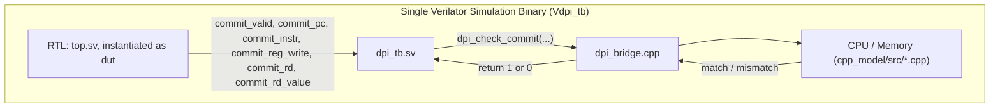

# 14. DPI-C Lockstep Verification

## 14.1 Why Live Lockstep, in Addition to Offline Differential Verification

Offline differential verification ([13_Differential_Verification.md](13_Differential_Verification.md)) compares two traces that were generated independently and only brought together afterward. This is powerful, but it has a structural weakness: both traces are text logs, generated and post-processed through shell scripting, file I/O, and a separate comparator binary. Any bug in that pipeline — a formatting mismatch silently "fixed" by a lenient parser, a truncated trace, a race in how output is captured — could theoretically produce a false pass.

**Live DPI-C lockstep verification removes this entire layer of indirection.** The C++ golden model is compiled directly into the same Verilator simulation binary as the RTL, and is called, via SystemVerilog's DPI-C (Direct Programming Interface), on every single cycle the RTL commits an instruction — during the simulation itself, not after it. There is no trace file, no text parsing, and no separate comparator process for this path; the comparison happens as native function calls inside one running process, and any mismatch triggers an immediate `$fatal` inside the simulation.

This is the verification technique used in real industry CPU bring-up when a full formal/UVM environment is not yet available: run the RTL and a reference model together, in the same process, checking every retirement in real time.

## 14.2 Architecture



Both the RTL and the C++ golden model exist as compiled code inside one executable (`sim/dpi_build/obj_dir/Vdpi_tb`), built by a single Verilator invocation that compiles the SystemVerilog RTL/testbench and links in the C++ model's object files together (§14.5).

## 14.3 DPI-C Function Interface

Four `extern "C"` functions in `cpp_model/dpi/dpi_bridge.cpp`, imported into `tb/dpi/dpi_tb.sv` via `import "DPI-C"`:

| Function | Called From | Purpose |
|---|---|---|
| `dpi_init(program_file)` | Once, at simulation start | Loads the same `.hex` program into a fresh C++ `Memory`/`CPU` pair |
| `dpi_check_commit(pc, instr, reg_write, rd, rd_value)` | Every cycle `commit_valid` is high | Steps the C++ model by exactly one instruction and compares its result against the RTL's commit fields |
| `dpi_reference_finished()` | After every successful `dpi_check_commit` | Reports whether the C++ model's PC has left the loaded program |
| `dpi_finish()` | Once, when `dpi_reference_finished()` first returns true | Performs a final consistency check and reports the mismatch tally |

### SystemVerilog Side (`tb/dpi/dpi_tb.sv`)

```systemverilog
import "DPI-C" function int dpi_init(input string program_file);
import "DPI-C" function int dpi_check_commit(
    input int unsigned rtl_pc,
    input int unsigned rtl_instruction,
    input int          rtl_reg_write,
    input int unsigned rtl_rd,
    input int unsigned rtl_rd_value
);
import "DPI-C" function int dpi_reference_finished();
import "DPI-C" function int dpi_finish();
```

## 14.4 The Per-Cycle Checking Loop

```systemverilog
always @(posedge clk) begin
    if (!rst && commit_valid) begin
        commit_count = commit_count + 1;

        dpi_status = dpi_check_commit(
            commit_pc,
            commit_instr,
            commit_reg_write,
            {27'b0, commit_rd},
            commit_rd_value
        );

        if (dpi_status == 0) begin
            $display("[DPI TB] Lockstep failure at commit %0d", commit_count);
            $fatal(1, "[DPI TB] RTL / C++ architectural mismatch");
        end

        reference_finished = dpi_reference_finished();

        if (reference_finished != 0) begin
            dpi_status = dpi_finish();
            if (dpi_status == 0) begin
                $fatal(1, "[DPI TB] Golden model final check failed");
            end
            $display("DPI TEST PASSED");
            $finish;
        end
    end
end
```

Every cycle the RTL asserts `commit_valid`, the testbench immediately calls `dpi_check_commit` with the RTL's commit fields for that cycle. `dpi_check_commit` internally steps the C++ model exactly once and compares — this is what makes it "lockstep": the C++ model never runs ahead of or behind the RTL by more than the single instruction being checked in that call. On any mismatch, the simulation halts immediately (`$fatal`) rather than continuing to accumulate further mismatches, which keeps the failure report focused on the very first point of divergence.

There is also a `MAX_CYCLES = 1000` safety timeout (checked in a separate `always @(posedge clk)` block) that fires `$fatal` if the simulation runs longer than 1000 cycles without either a mismatch or a natural finish — a defensive guard against a hung or infinite-looping program.

## 14.5 The C++ Bridge (`dpi_bridge.cpp`)

### Initialization

```cpp
extern "C" int dpi_init(const char* programFile)
{
    g_memory = std::make_unique<Memory>();
    if (!g_memory->loadHexFile(programFile, 0)) { ...; return 0; }
    g_cpu = std::make_unique<CPU>(*g_memory);
    g_commitCount = 0;
    g_mismatches = 0;
    return 1;
}
```

A fresh `Memory`/`CPU` pair, held in file-scope `std::unique_ptr`s, is created once per simulation run, loading the same `.hex` file the RTL's `instruction_memory` was loaded with (both driven by the same `+PROGRAM=` argument, passed to `dpi_init` from `dpi_tb.sv`'s own `$value$plusargs` read).

### Per-Commit Checking

```cpp
extern "C" int dpi_check_commit(uint32_t rtlPC, uint32_t rtlInstruction,
                                 int rtlRegWrite, uint32_t rtlRD, uint32_t rtlRDValue)
{
    if (!g_cpu->isPCInProgram()) {
        std::cerr << "[DPI ERROR] RTL produced an extra commit after the C++ model finished\n";
        return 0;
    }

    Commit reference{};
    if (!g_cpu->step(reference)) { ...; return 0; }

    ++g_commitCount;

    bool match = true;
    if (rtlPC != reference.pc) match = false;
    if (rtlInstruction != reference.instruction) match = false;

    const bool rtlWritesRegister = (rtlRegWrite != 0) && (rtlRD != 0);
    const bool cppWritesRegister = reference.regWrite && (reference.rd != 0);
    if (rtlWritesRegister != cppWritesRegister) match = false;

    if (rtlWritesRegister && cppWritesRegister) {
        if (rtlRD != reference.rd) match = false;
        if (rtlRDValue != reference.rdValue) match = false;
    }

    if (!match) { ++g_mismatches; /* print full mismatch report */ return 0; }

    std::cout << "[DPI PASS] Commit " << g_commitCount << " PC=0x" << rtlPC << '\n';
    return 1;
}
```

Two details worth highlighting:

1. **`isPCInProgram()` is checked before stepping the model** — if the RTL somehow produces more commits than the C++ model has instructions for (e.g. an RTL bug causing it to keep committing NOPs from padded instruction memory in a way the testbench mistakes for real commits, or a runaway control-flow bug in the RTL), this is caught explicitly as "RTL produced an extra commit after the C++ model finished," rather than the C++ model executing into undefined/out-of-program territory.
2. **`x0`-destined writes are excluded from the "does this instruction write a register" comparison** (`rtlRD != 0`, `reference.rd != 0`), consistent with the architectural fact that a write to `x0` has no observable effect — matching the same treatment applied throughout the RTL (§3.4, §9.3) and the C++ model (§12.5).

### Termination Check

```cpp
extern "C" int dpi_reference_finished()
{
    return g_cpu->isPCInProgram() ? 0 : 1;
}

extern "C" int dpi_finish()
{
    if (g_cpu->isPCInProgram()) {
        std::cerr << "[DPI ERROR] Simulation ended before the C++ model finished\n";
        return 0;
    }
    std::cout << "DPI LOCKSTEP VERIFICATION PASSED\nCommits: " << g_commitCount
              << "\nMismatches: " << g_mismatches << '\n';
    return g_mismatches == 0 ? 1 : 0;
}
```

`dpi_finish()` performs a final symmetry check: not only must there be zero mismatches, but the C++ model must have *also* reached the end of its program at exactly the point the RTL stopped committing new instructions — guarding against the RTL silently stopping early (e.g. getting permanently stuck in a stall) while the C++ model still has instructions left to execute, which `dpi_reference_finished()` alone (checked only after a successful commit) would not otherwise catch on its own if the RTL simply stopped producing commits altogether.

## 14.6 Build Process (`scripts/build_dpi.sh`)

```bash
verilator \
    --binary --timing --sv \
    --top-module dpi_tb \
    --Mdir "$OBJ_DIR" \
    -Wall -Wno-fatal \
    -Irtl/core -Irtl/pipeline -Irtl/decoder -Irtl/alu -Irtl/regfile -Irtl/hazard -Irtl/memory \
    -CFLAGS "-std=c++17 -I$(pwd)/cpp_model/include" \
    "${RTL_SOURCES[@]}" \
    "$TB_SOURCE" \
    "${CPP_SOURCES[@]}"
```

All 16 RTL source files, `tb/dpi/dpi_tb.sv`, and four C++ sources (`cpu.cpp`, `decoder.cpp`, `memory.cpp`, `dpi_bridge.cpp` — notably *not* `main.cpp` or `trace_main.cpp`, which are unrelated entry points not needed here) are compiled together by a single Verilator invocation using `--binary` mode (Verilator generates and builds a self-contained executable rather than a library to be linked externally). `--timing` enables support for the delay/timing constructs used in the testbench (`forever #5 clk = ~clk;`, `repeat (5) @(posedge clk);`), and `-CFLAGS "-std=c++17 ..."` ensures the embedded C++ model compiles with the same language standard it was written against.

## 14.7 Test-by-Test Results (Checked-In Logs)

| Test | Result |
|---|---|
| `alu` | DPI TEST PASSED |
| `beq_not_taken` | DPI TEST PASSED |
| `beq_taken` | DPI TEST PASSED |
| `branches` | DPI TEST PASSED |
| `forwarding` | DPI TEST PASSED |
| `full_regression` | DPI TEST PASSED |
| `jal` | DPI TEST PASSED |
| `jalr` | DPI TEST PASSED |
| `load_store` | DPI TEST PASSED |
| `load_use` | DPI TEST PASSED |

**10 / 10 PASS**, confirmed directly from `sim/logs/dpi/*.log` in the repository.

## 14.8 Comparison: Offline Differential vs. DPI-C Lockstep

| Aspect | Offline Differential (§13) | DPI-C Lockstep (this section) |
|---|---|---|
| Execution | RTL and C++ model run as two separate processes | RTL and C++ model run in the same process |
| Comparison medium | Text trace files, parsed after both runs complete | Native function calls, compared during simulation |
| Failure granularity | First mismatched line in a post-hoc text diff | Immediate `$fatal` at the exact simulation cycle of divergence |
| Simulator used | Icarus Verilog (`sim/cpu_sim`) for RTL, plain C++ binary for the model | Verilator, with the C++ model compiled directly into the same binary |
| What it additionally guards against | — | Any bug specific to trace formatting, file I/O, or the standalone comparator tool itself, since none of that machinery exists in this path |

## 14.9 Related Files

- `tb/dpi/dpi_tb.sv` — the DPI-C-aware SystemVerilog testbench
- `cpp_model/dpi/dpi_bridge.cpp` — the C++ side of the bridge
- `scripts/build_dpi.sh` — Verilator build script
- `scripts/run_dpi_regression.sh` — runs all 10 directed tests through the built binary
- `sim/logs/dpi/*.log` — one log per directed test
