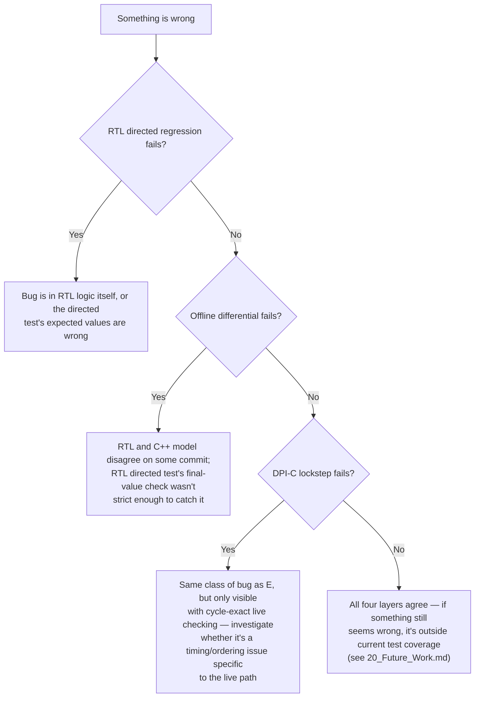

# 17. Debugging Guide

## 17.1 First Question: Which Layer Is Failing?

Because this project has four independent verification layers, the first diagnostic step is always to determine *which* layer first reports a problem — this narrows the search dramatically:



## 17.2 RTL Directed Regression Failures

### Reading the Log

```
sim/logs/<test_name>.log
```

Look for `[FAIL]` lines from `check_reg` — each one names the exact register, expected value, and actual value:

```
[FAIL] x1 expected 42 (0x0000002a), got 0 (0x00000000)
```

A value of exactly `0` where a non-zero value was expected often points to a register write that never happened at all (check `reg_write` control-signal propagation, §5) rather than a computed-wrong-value bug (which would typically show some other non-zero, non-matching value).

### Checking Assertion Output

Every run also includes the `pipeline_assertions.sv` summary (§15.3) at the end of the log:

```
==================================================
            ASSERTION SUMMARY
==================================================
Assertion failures : 0
ASSERTIONS PASSED
==================================================
```

If `check_reg` fails but assertions pass, the bug is likely a data-value computation error (wrong ALU operation, wrong immediate, wrong control signal) rather than a hazard/forwarding/flush-timing bug, since the assertions specifically target hazard/forwarding/flush legality (§15.3). If assertions also fail, start there — an assertion failure identifies a specific structural invariant violation (e.g. "Control transfer without IF/ID flush"), which is usually a faster path to root cause than working backward from a wrong final register value.

### Waveform Debugging

```systemverilog
initial begin
    $dumpfile("waves/top.vcd");
    $dumpvars(0, top_tb);
end
```

`top_tb.sv` unconditionally dumps every signal in the testbench hierarchy (`$dumpvars(0, top_tb)` — depth 0 means "all levels," so this includes every internal RTL signal in `dut`, not just testbench-level signals) to `waves/top.vcd` on every run. Open this in GTKWave (or any VCD viewer) and look at, in order of usefulness for pipeline bugs specifically:

1. `dut.pc_current`, `dut.if_id_instruction`, `dut.id_ex_instr`, `dut.ex_mem_instr`, `dut.mem_wb_instr` — track a specific instruction as it moves through the pipeline stage by stage.
2. `dut.pc_write`, `dut.if_id_write`, `dut.id_ex_flush`, `dut.if_id_flush` — confirm stall/flush signals assert exactly when and for as long as expected (§7, §8, §10).
3. `dut.forward_a`, `dut.forward_b` — confirm forwarding selects the expected source at the expected cycle (§9).
4. `dut.commit_valid`, `dut.commit_pc`, `dut.commit_rd_value` — the architectural ground truth for whatever the instruction currently in MEM/WB actually did.

### Common Failure Signatures

| Symptom | Likely Area |
|---|---|
| One specific register always wrong, others correct | Wrong ALU operation for that instruction's `funct3`/`funct7` (§6.2) |
| Register correct in isolation, wrong when immediately preceded by a dependent instruction | Forwarding priority or missing forwarding path (§9) |
| Register wrong only in `load_use.hex`, correct elsewhere | Load-use hazard detection (§8) |
| Execution continues past a branch/jump as if it weren't taken | `control_transfer_ex` or redirect-target computation (§10) |
| `x0` check fails at the very start of every test | Register file's `x0` write-suppression logic (§3.4) — a fundamental, wide-reaching bug if this is broken |

## 17.3 C++ Golden-Model Failures

### `test_runner` Output

```
[FAIL] x1 expected 42, got 0
```

Same interpretation as the RTL `check_reg` failures — the golden model itself has a bug, or (less likely, since this is independently written from the RTL) the test's expected values are wrong. If a C++ regression failure occurs alongside RTL regression *passing* on the same test, treat that as a strong signal to re-derive the expected value by hand rather than assuming the C++ model is at fault, since the C++ model has no pipeline logic to get wrong — its bugs, if any, are more likely to be in basic instruction semantics (§12.4).

### Stale Log Warning

If you encounter `cpp_regression_new.log` at the repository root showing a 0/10 failure, **do not treat this as the current status** — as established in [19_Limitations.md](19_Limitations.md), this log predates a fix to the model's termination behavior. Rebuild `test_runner.cpp` fresh (§16.3) before drawing any conclusions from a C++ regression failure.

## 17.4 Differential Verification Failures

### Reading a `diff_<name>.log`

```
[MISMATCH] Register value

==================================================
      DIFFERENTIAL VERIFICATION FAILURE
==================================================

Commit index : 4

RTL:
  PC          = 0x00000010
  Instruction = 0x002081b3
  Reg write   = x3
  Reg value   = 0x0000001e

C++ Reference:
  PC          = 0x00000010
  Instruction = 0x002081b3
  Reg write   = x3
  Reg value   = 0x00000014
```

This report gives the exact commit index and full side-by-side state — the PC and instruction word matching (both `0x00000010`/`0x002081b3` above) but the register value differing tells you precisely which instruction executed correctly at the fetch/decode level but produced the wrong result, narrowing the search to that instruction's execute-stage logic specifically, in either the RTL or (less commonly) the C++ model.

### Trace Length Mismatch

```
==================================================
              TRACE LENGTH MISMATCH
==================================================
RTL commits : 42
C++ commits : 40
```

Since `run_differential.sh` always passes an explicit `commit_count` (derived from the C++ trace) to `compare_traces`, a length-mismatch report specifically means `compare_traces` was invoked *without* the count argument (i.e., manually, not through the script) — see §13.5 for why the two traces naturally differ in length (the RTL runs a fixed 100 cycles and keeps committing padded NOPs after the real program ends, while the C++ model stops exactly at the program boundary). If you see this running the script itself, that indicates a bug in the script's `commit_count` computation, not in the RTL or C++ model.

### Isolating RTL vs. C++ as the Source

Cross-reference against the RTL-only directed test result for the same program:

- **RTL directed test also fails** → bug is very likely in the RTL (both independent checks agree something is wrong).
- **RTL directed test passes, differential fails** → either the RTL directed test's specific `check_reg` calls simply don't check the value that's wrong (the most common case — directed tests check final state, not every intermediate commit), or the C++ model itself has a bug. Check the mismatching commit's instruction against `cpu.cpp`'s `executeInstruction` implementation for that operation.

## 17.5 DPI-C Lockstep Failures

### Reading the Log

```
[DPI TB] Lockstep failure at commit 7

==================================================
        DPI LOCKSTEP MISMATCH
==================================================

Commit index : 7

RTL:
  PC          = 0x0000001c
  ...

C++ Reference:
  PC          = 0x0000001c
  ...

==================================================
```

Functionally identical in content to a differential-verification mismatch (§17.4), but produced live, during simulation, by `dpi_bridge.cpp`. If a DPI-C lockstep failure occurs at the *same* commit index and with the *same* field mismatch as an offline differential failure for the same test, this confirms the bug is a genuine RTL/C++ architectural disagreement, not an artifact of either verification path's own tooling.

### Timeout

```
[DPI TB] TIMEOUT after 1000 cycles
```

Indicates the simulation ran past `MAX_CYCLES = 1000` without either a mismatch or the C++ model reaching the end of its program. For these small directed test programs (at most 42 instructions, per `full_regression.hex`), this would only occur if the RTL entered an unexpected infinite loop (e.g., a control-flow bug causing a branch to repeatedly redirect to itself) or if `commit_valid` stopped asserting entirely (e.g., the pipeline permanently stalled) — check `dut.pc_current` and `dut.control_transfer_ex` over time in a waveform dump to distinguish these two cases (note: the DPI-C testbench does not dump a VCD file by default, unlike `top_tb.sv` — see [19_Limitations.md](19_Limitations.md) for this and other DPI-C-specific tooling gaps).

## 17.6 General Debugging Tips

- **Reproduce with the smallest failing test first.** `full_regression.hex` (40 words) is harder to debug than `alu.hex` (5 words) — if a bug reproduces in a smaller directed test, debug there.
- **Cross-check against all four layers, not just the one that first reported failure.** A bug that's genuinely in the RTL should show up in the RTL directed test, differential verification, and DPI-C lockstep together; a bug isolated to only one layer's tooling (e.g. only the differential comparator, not DPI-C) points at that specific tool rather than the design itself.
- **Re-derive expected values by hand for the specific failing instruction**, rather than trusting either the RTL's or the C++ model's output as ground truth, when both disagree — the RISC-V specification (or the ALU/branch tables in [06_ALU_and_Datapath.md](06_ALU_and_Datapath.md)) is the actual ground truth.
- **When editing RTL, always re-run the full suite (`./scripts/run_all.sh`), not just the directed test related to the change** — the four-layer structure specifically exists to catch regressions in features the change wasn't intended to touch (e.g. a forwarding-unit edit that inadvertently affects the load-use hazard interaction, §8/§9).

## 17.7 Related Files

- `waves/top.vcd` — waveform dump from the most recent RTL directed regression run
- `sim/logs/*.log`, `sim/logs/dpi/*.log`, `traces/differential/*.log` — all layer-specific logs, described in Sections 13–15
