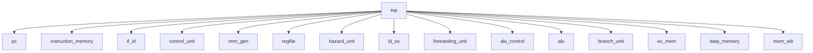

# 02. Repository Architecture

## 2.1 Top-Level Layout

```
Riscvprocessor/
├── rtl/                    Synthesizable SystemVerilog design
├── tb/                     SystemVerilog testbenches and assertions
├── cpp_model/              C++17 golden reference model + DPI-C bridge
├── tests/directed/         Directed .hex test programs (shared by all layers)
├── scripts/                Build and regression automation
├── sim/                    RTL/DPI simulation binaries and logs
├── traces/differential/    RTL / C++ / diff logs for offline verification
├── waves/                  Waveform dump (top.vcd)
├── docs/                   This documentation set
├── .github/workflows/      CI workflow definition (present, currently empty)
├── README.md               Project README (present, currently empty in repo)
└── program.hex             Stray root-level hex file (not referenced by any script)
```

## 2.2 RTL Directory (`rtl/`)

| Directory | File | Module | Role |
|---|---|---|---|
| `rtl/core/` | `top.sv` | `top` | Top-level pipeline integration and commit interface |
| `rtl/core/` | `pc.sv` | `pc` | Program counter register |
| `rtl/core/` | `branch_unit.sv` | `branch_unit` | Branch condition evaluation |
| `rtl/decoder/` | `control_unit.sv` | `control_unit` | Instruction decode → control signals |
| `rtl/decoder/` | `alu_control.sv` | `alu_control` | `alu_op`/`funct3`/`funct7` → 4-bit ALU opcode |
| `rtl/decoder/` | `imm_gen.sv` | `imm_gen` | Immediate extraction/sign-extension for all formats |
| `rtl/alu/` | `alu.sv` | `alu` | Arithmetic/logic execution unit |
| `rtl/regfile/` | `regfile.sv` | `regfile` | 32×32-bit register file, x0 hardwired to zero |
| `rtl/pipeline/` | `if_id.sv` | `if_id` | IF/ID pipeline register |
| `rtl/pipeline/` | `id_ex.sv` | `id_ex` | ID/EX pipeline register |
| `rtl/pipeline/` | `ex_mem.sv` | `ex_mem` | EX/MEM pipeline register |
| `rtl/pipeline/` | `mem_wb.sv` | `mem_wb` | MEM/WB pipeline register |
| `rtl/hazard/` | `hazard_unit.sv` | `hazard_unit` | Load-use hazard detection and stall control |
| `rtl/hazard/` | `forwarding_unit.sv` | `forwarding_unit` | EX-stage operand forwarding selection |
| `rtl/memory/` | `instruction_memory.sv` | `instruction_memory` | Word-addressable instruction ROM/RAM |
| `rtl/memory/` | `data_memory.sv` | `data_memory` | Word-addressable data RAM |

## 2.3 Module Dependency Diagram



`top.sv` is the only module that instantiates other modules — every RTL block below it is a leaf module with no sub-instances. All cross-module communication (forwarding, hazard signaling, flushing) is wired explicitly in `top.sv` rather than being distributed inside the pipeline register modules.

## 2.4 Testbench Directory (`tb/`)

| File | Purpose |
|---|---|
| `tb/basic/top_tb.sv` | Directed testbench. Selects one of 10 tests via `+TEST_ID`, loads the matching `.hex` file via `+PROGRAM`, drives clock/reset, and checks final register values against expectations encoded per test. |
| `tb/assertions/pipeline_assertions.sv` | 14 concurrent SystemVerilog assertions bound into the simulation, checking invariants that must hold on every cycle regardless of which program is running (see [15_Testing.md](15_Testing.md)). |
| `tb/dpi/dpi_tb.sv` | Verilator-compatible testbench that imports the DPI-C functions in `cpp_model/dpi/dpi_bridge.cpp` and calls `dpi_check_commit` every cycle the RTL commits an instruction. |

## 2.5 C++ Model Directory (`cpp_model/`)

| File | Purpose |
|---|---|
| `include/instruction.h` | `Opcode`/`Operation` enums and the `DecodedInstruction` struct |
| `include/decoder.h` | `Decoder` class declaration |
| `include/cpu.h` | `CPU` class declaration — architectural state and `step()` interface |
| `include/memory.h` | `Memory` class declaration — byte-addressable backing store with hex-file loader |
| `include/commit.h` | `CommitRecord` struct — the C++-side equivalent of the RTL commit interface |
| `include/trace_parser.h` | Parses `COMMIT ...` lines emitted by the RTL simulation into `CommitRecord`s |
| `src/decoder.cpp` | Instruction decode implementation |
| `src/cpu.cpp` | Fetch/execute/writeback implementation, `CPU::step()` |
| `src/memory.cpp` | Memory implementation, hex-file loader, program-bounds tracking |
| `src/trace_main.cpp` | CLI tool: runs a program to completion and emits a `COMMIT ...` trace matching the RTL's format |
| `src/trace_parser.cpp` | Implementation of the RTL trace-line parser |
| `src/main.cpp` | Standalone reference-model CLI tool (`rv32_ref`) — see [19_Limitations.md](19_Limitations.md) for a build issue in this file |
| `dpi/dpi_bridge.cpp` | `extern "C"` DPI-C entry points wrapping a `CPU` instance for use from SystemVerilog |
| `tools/compare_traces.cpp` | Offline differ: reads an RTL trace file and a C++ trace file and reports the first mismatch, if any |
| `tests/test_runner.cpp` | 10 self-checking C++ unit tests, one per directed test program |
| `Makefile` | Present in the repository but currently empty (0 bytes) — building is done by the shell scripts in `scripts/`, not by this Makefile |

## 2.6 Test Programs (`tests/directed/`)

All four verification layers (RTL regression, C++ regression, offline differential, DPI lockstep) consume the same ten `.hex` files, guaranteeing that "the same test" means the same machine code everywhere.

| File | Word Count | Exercises |
|---|---|---|
| `alu.hex` | 5 | R-type/I-type ALU operations |
| `beq_taken.hex` | 6 | `BEQ`, taken path |
| `beq_not_taken.hex` | 6 | `BEQ`, not-taken path |
| `branches.hex` | 18 | All six branch conditions |
| `forwarding.hex` | 5 | EX/MEM and MEM/WB forwarding paths |
| `jal.hex` | 4 | `JAL` |
| `jalr.hex` | 6 | `JALR` |
| `load_store.hex` | 3 | `LW`/`SW` |
| `load_use.hex` | 4 | Load-use hazard stall |
| `full_regression.hex` | 40 | Composite program covering all of the above |

## 2.7 Scripts Directory (`scripts/`)

| Script | Purpose |
|---|---|
| `run_regression.sh` | Compiles and runs the RTL directed regression (Icarus Verilog) |
| `run_cpp_regression.sh` | Builds and runs the C++ golden-model unit test suite |
| `run_differential.sh` | Runs the RTL simulation to produce a commit trace, runs the C++ model to produce a matching trace, and diffs them |
| `build_dpi.sh` | Builds the Verilator + DPI-C lockstep simulation binary |
| `run_dpi_regression.sh` | Runs the DPI-C lockstep binary against all 10 directed programs |
| `run_all.sh` | Runs all of the above in sequence and prints a combined summary |

Full command listings are in [16_Build_Guide.md](16_Build_Guide.md).

## 2.8 Simulation Artifacts (`sim/`, `traces/`, `waves/`)

| Path | Contents |
|---|---|
| `sim/cpu_sim` | Prebuilt Icarus Verilog simulation binary for the RTL directed regression |
| `sim/logs/*.log` | One log per directed test, RTL regression results |
| `sim/logs/dpi/*.log` | One log per directed test, DPI-C lockstep results |
| `sim/dpi_build/obj_dir/` | Verilator-generated build directory for the DPI-C lockstep simulation |
| `traces/differential/rtl_*.log` | RTL commit trace, one per directed test |
| `traces/differential/cpp_*.log` | C++ golden-model commit trace, one per directed test |
| `traces/differential/diff_*.log` | Result of `compare_traces` for each test |
| `waves/top.vcd` | Waveform dump for post-run debugging in GTKWave or similar |

## 2.9 Items Present but Not Part of the Functional Design

The following exist in the repository but are either empty placeholders or build/editor artifacts, and are documented here for completeness rather than treated as functional modules:

- `README.md` (root) and `cpp_model/README.md` — both 0 bytes
- `.github/workflows/ci.yml` — 0 bytes, no CI currently configured
- `cpp_model/Makefile` — 0 bytes, unused
- `program.hex` (repository root) — not referenced by any script in `scripts/`
- `cpp_regression_new.log` (repository root) — a stale regression log; see [19_Limitations.md](19_Limitations.md)
- `.vscode/`, `.DS_Store` — editor/OS metadata
- `cpp_model/build/`, `sim/dpi_build/obj_dir/` — compiled binaries and Verilator-generated intermediate files